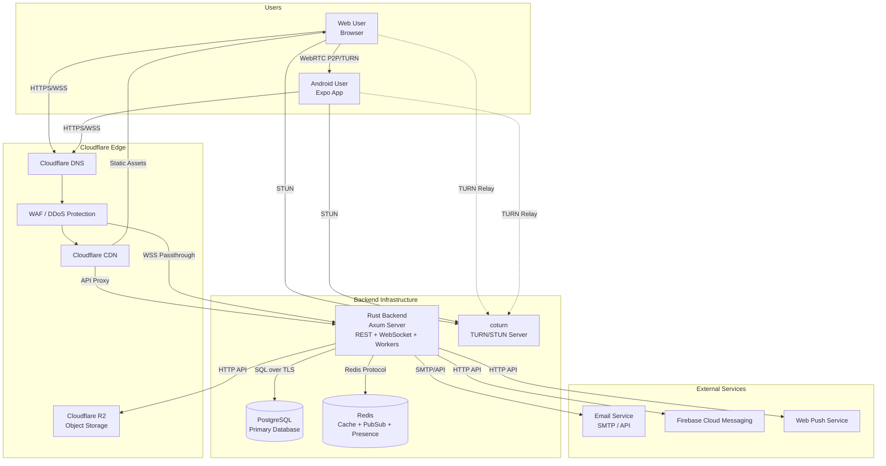
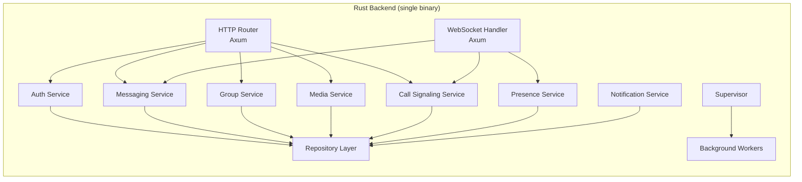
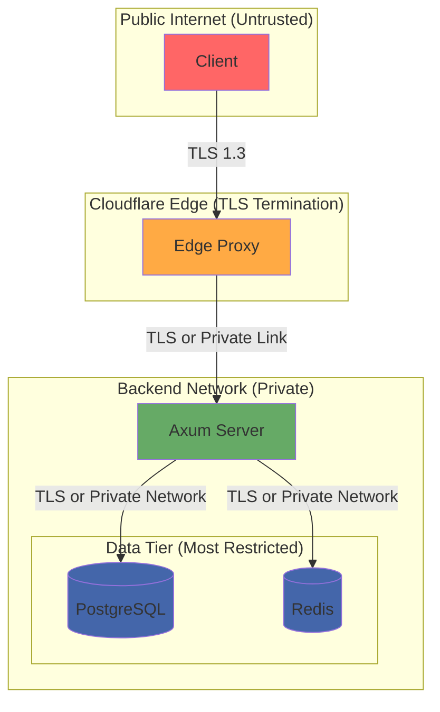

# Architecture Overview — YBM Connect

| Field             | Value                                      |
|-------------------|--------------------------------------------|
| **Document ID**   | `DOC-ARCH-001`                             |
| **Version**       | `1.0.0`                                    |
| **Status**        | `APPROVED`                                 |
| **Owner**         | Engineering Lead                           |
| **Last Updated**  | 2026-10-02                                 |
| **Related Docs**  | DOC-OVR-001, DOC-ARCH-002 through 010     |
| **Related ADRs**  | ADR-001 through ADR-017                    |

---

## 1. Architectural Style: Modular Monolith

YBM Connect's backend is a **modular monolith** — a single deployable binary with strong internal module boundaries. See [ADR-011](architecture-decisions/ADR-011-modular-monolith.md) for the full rationale.

### Why Not Microservices?
At the current project scale (solo/small team, single deployment region), microservices would add:
- Network serialization overhead between services
- Distributed transaction complexity
- Multiple deployment pipelines
- Service discovery and mesh infrastructure
- Operational burden disproportionate to team size

### When to Extract a Service
A module is extracted into a separate service only when one or more conditions are met:

| # | Condition | Example |
|---|-----------|---------|
| 1 | Independent scaling | Media processing needs more CPU than API serving |
| 2 | Independent failure domain | TURN server must not crash with API |
| 3 | Different runtime | TURN needs UDP; Axum needs TCP |
| 4 | Different deploy lifecycle | Frontend deploys without backend |
| 5 | Security isolation | Secrets vault runs separately |
| 6 | Different resource profile | Video transcoding is CPU-bound |
| 7 | Independent ownership | Separate team responsibility |
| 8 | Clear operational benefit | Reduces blast radius |

**Current architecture has exactly 4 deployment units:**
1. **Rust Backend** — Axum monolith (REST + WebSocket + workers)
2. **Web Frontend** — Next.js static/SSR deployment
3. **Mobile App** — Expo/React Native build
4. **TURN Server** — coturn (separate because: different protocol (UDP), different resource profile, pre-built binary)

PostgreSQL, Redis, and Cloudflare R2 are managed infrastructure, not deployment units we build.

## 2. System Context Diagram



### Node Descriptions

| Node | Role | Protocol | Failure Behavior |
|------|------|----------|------------------|
| **Web User** | Browser-based client | HTTPS, WSS, WebRTC | Reconnects on disconnect; offline queue |
| **Android User** | Mobile client | HTTPS, WSS, WebRTC | Reconnects; push notifications when offline |
| **Cloudflare DNS** | DNS resolution | DNS | Cloudflare manages failover |
| **Cloudflare CDN** | Static asset delivery, API proxy | HTTPS | Falls back to origin on cache miss |
| **Cloudflare WAF** | DDoS/attack protection | HTTPS | Blocks malicious traffic at edge |
| **Cloudflare R2** | Media object storage | S3 API | Returns 503 on outage; media temporarily unavailable |
| **Axum Server** | All backend logic | HTTP, WebSocket | Health checks; restart on crash; graceful shutdown |
| **PostgreSQL** | Persistent data store | PostgreSQL wire protocol | Connections pool with retry; read replicas optional |
| **Redis** | Cache, pub/sub, presence | Redis protocol | System degrades: no realtime routing, no presence; messages still persist |
| **coturn** | TURN/STUN relay | STUN (UDP), TURN (UDP/TCP) | Calls fall back to STUN-only; some calls may fail |
| **Email Service** | OTP delivery | SMTP or HTTP API | Registration/reset delayed; system continues |
| **FCM** | Android push | HTTP/2 | Notifications delayed; messages still delivered on app open |
| **Web Push** | Browser push | HTTP | Same as FCM |

## 3. Container Architecture



## 4. Layered Architecture

The backend follows strict layering. Each layer has a clear responsibility and dependencies flow downward only.

```
┌──────────────────────────────────────────────────────┐
│                   Transport Layer                     │
│  Axum HTTP handlers, WebSocket handlers               │
│  Responsibility: Parse requests, route, serialize     │
│  NO business logic here                               │
├──────────────────────────────────────────────────────┤
│                   Service Layer                       │
│  AuthService, MessagingService, GroupService, etc.    │
│  Responsibility: Business logic, orchestration        │
│  This is where rules live                             │
├──────────────────────────────────────────────────────┤
│                  Repository Layer                     │
│  UserRepo, MessageRepo, ConversationRepo, etc.       │
│  Responsibility: Data access, query construction      │
│  Abstracts database from service layer                │
├──────────────────────────────────────────────────────┤
│                   Domain Layer                        │
│  User, Message, Conversation, Group (structs/enums)   │
│  Responsibility: Type definitions, validation rules   │
│  No dependencies on infrastructure                    │
├──────────────────────────────────────────────────────┤
│                Infrastructure Layer                   │
│  PostgreSQL (sqlx), Redis, R2 client, email client    │
│  Responsibility: External system adapters             │
│  Behind trait interfaces for testability              │
└──────────────────────────────────────────────────────┘
```

### Rules
1. **Transport → Service**: Handlers call service methods. Handlers do NOT contain business logic.
2. **Service → Repository**: Services call repository methods. Services do NOT construct SQL.
3. **Repository → Infrastructure**: Repositories use sqlx/Redis clients. Repositories do NOT contain business rules.
4. **Domain**: Shared by all layers. Contains no I/O.
5. **Infrastructure**: Hidden behind trait interfaces (`trait UserRepository`, `trait CacheStore`). Enables testing with mocks.

## 5. Data Flow: Message Send

```mermaid
sequenceDiagram
    participant C as Client A
    participant WS as WebSocket Handler
    participant MS as Messaging Service
    participant REPO as Message Repository
    participant PG as PostgreSQL
    participant REDIS as Redis
    participant WS2 as WebSocket Handler (Instance B)
    participant C2 as Client B

    C->>WS: message.send {client_message_id, content}
    WS->>MS: send_message(user_id, payload)
    MS->>MS: validate(content)
    MS->>REPO: find_by_client_message_id(id)
    REPO->>PG: SELECT ... WHERE client_message_id = ?
    PG-->>REPO: None (not duplicate)
    REPO-->>MS: None
    MS->>REPO: insert_message(msg)
    REPO->>PG: BEGIN; INSERT INTO messages ...; COMMIT;
    PG-->>REPO: Ok(message_row)
    REPO-->>MS: Ok(message)
    MS-->>WS: message.ack {server_id, timestamp}
    WS-->>C: message.ack

    MS->>REDIS: PUBLISH conversation:{id} message_event
    REDIS-->>WS2: message_event (subscription)
    WS2->>C2: message.new {message}
    C2->>WS2: message.delivered {message_id}
    WS2->>MS: record_delivery(message_id, user_id)
    MS->>REPO: insert_receipt(receipt)
    REPO->>PG: INSERT INTO message_receipts ...
    MS->>REDIS: PUBLISH user:{sender_id} status_event
    REDIS-->>WS: status_event
    WS->>C: message.status {delivered}
```

### Critical Design Decisions in This Flow
1. **ACK after commit**: The `message.ack` is sent only after the PostgreSQL transaction commits. This guarantees NFR-008 (message durability).
2. **Idempotency via client_message_id**: If the client retries (e.g., after network timeout), the duplicate check (step 4-6) prevents double persistence.
3. **Redis for cross-instance routing**: If sender and recipient are on different backend instances, Redis pub/sub routes the event. If Redis is down, the message is still persisted — the recipient receives it on sync.
4. **Delivery receipt is asynchronous**: The recipient's `message.delivered` is best-effort. If it fails, the receipt is recorded on next sync.

## 6. Security Boundaries



| Boundary | Trust Level | Controls |
|----------|-------------|----------|
| Client ↔ Edge | Untrusted | TLS, WAF, DDoS protection, rate limiting |
| Edge ↔ Backend | Semi-trusted | Authenticated proxy, IP allowlisting |
| Backend ↔ Database | Trusted | Private network, connection auth, encrypted connections |

## 7. Key Architecture Decisions Summary

| ADR | Decision | Key Rationale |
|-----|----------|---------------|
| ADR-001 | Rust backend | Performance, memory safety, async |
| ADR-002 | Tokio runtime | De facto Rust async runtime |
| ADR-003 | Axum framework | Tokio-native, Tower ecosystem |
| ADR-004 | PostgreSQL | ACID, relational, proven at scale |
| ADR-005 | Redis | Sub-millisecond ops, pub/sub, TTL |
| ADR-006 | WebSocket | Bidirectional, low-overhead real-time |
| ADR-007 | WebRTC | Standard P2P media, browser-native |
| ADR-008 | TURN (coturn) | NAT traversal for restrictive networks |
| ADR-009 | Cloudflare | Edge CDN, DNS, TLS, R2, free tier |
| ADR-010 | Cloudflare R2 | S3-compatible, zero egress fees |
| ADR-011 | Modular monolith | Simplicity until scale demands extraction |
| ADR-012 | Erlang-inspired supervision | Fault tolerance via manual Tokio patterns |
| ADR-013 | No initial microservices | Operational simplicity for small team |
| ADR-014 | Auth strategy | Argon2id, short-lived tokens, rotation |
| ADR-015 | Message idempotency | Client-generated UUID prevents duplicates |
| ADR-016 | Message ordering | Server timestamp + sequence per conversation |
| ADR-017 | Media via R2 | Signed URLs, server-side validation |

---

*Next: [system-context.md](system-context.md) · [container-architecture.md](container-architecture.md)*
