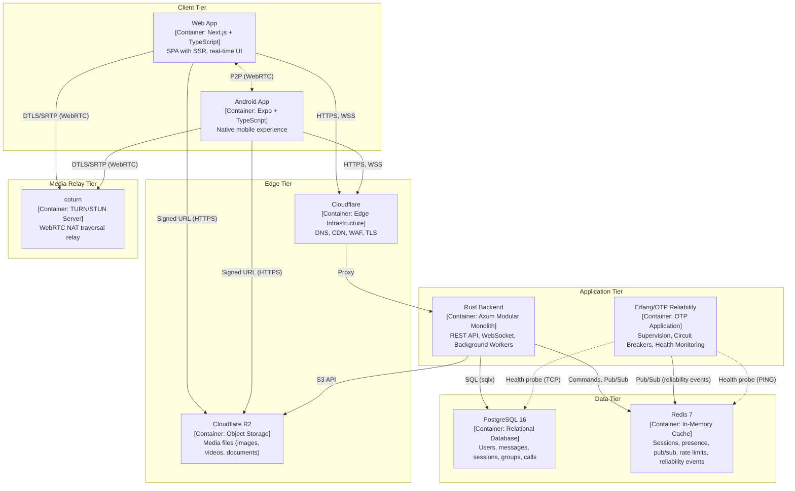

# Container Architecture (C4 Level 2) — YBM Connect

| Field             | Value                                      |
|-------------------|--------------------------------------------|
| **Document ID**   | `DOC-ARCH-003`                             |
| **Version**       | `1.1.0`                                    |
| **Status**        | `APPROVED`                                 |
| **Owner**         | Engineering Lead                           |
| **Last Updated**  | 2026-10-04                                 |
| **Related Docs**  | DOC-ARCH-001, DOC-ARCH-002                 |

---

## Container Diagram

## Container Responsibilities

| Container | Technology | Responsibilities | Communication |
|-----------|-----------|-----------------|---------------|
| **Web App** | Next.js 14, TypeScript, Zustand | UI rendering, local state, WebSocket client, WebRTC client, offline queue | HTTPS → Cloudflare → Backend; WSS for real-time; WebRTC for calls |
| **Android App** | Expo, React Native, TypeScript | Same as web + push notifications (FCM), secure storage, background handling | Same as web + FCM token registration |
| **Cloudflare** | Edge platform | DNS resolution, TLS termination, static asset CDN, DDoS protection, WAF | Proxy to backend origin |
| **Cloudflare R2** | Object storage | Store media files, serve via signed URLs, no egress fees | S3-compatible API from backend; signed URL downloads from clients |
| **Rust Backend** | Axum, Tokio, sqlx | REST API (auth, users, groups, media), WebSocket (messaging, presence, calls), background workers (notifications, cleanup), reliability event publishing | SQL to PostgreSQL, Redis protocol, S3 API to R2, HTTP to email/FCM |
| **Erlang/OTP Reliability** | Erlang/OTP 27, rebar3 | OTP supervision trees, dependency health monitors, circuit breakers (CLOSED/OPEN/HALF_OPEN), recovery coordination, aggregated health status | Redis Pub/Sub for reliability events, TCP/HTTP probes to PostgreSQL/Redis/R2 |
| **PostgreSQL** | PostgreSQL 16 | Persistent data storage, ACID transactions, relational integrity, full-text search (future) | Accessed by Rust backend via connection pool; probed by Erlang for health |
| **Redis** | Redis 7 | Session cache, presence state, typing indicators, pub/sub for cross-instance routing, rate limiting, Rust↔Erlang reliability event exchange | Accessed by Rust backend and Erlang reliability service |
| **coturn** | coturn TURN/STUN | NAT traversal for WebRTC, STUN reflexive address discovery, TURN media relay when P2P fails | UDP/TCP from clients; credential validation shared secret with backend |

## Communication Protocols

| From → To | Protocol | Port | TLS | Auth |
|-----------|----------|------|-----|------|
| Client → Cloudflare | HTTPS | 443 | ✅ Cloudflare-managed cert | — |
| Client → Cloudflare | WSS | 443 | ✅ Same TLS | Bearer token (query param) |
| Cloudflare → Backend | HTTPS | 8080 | ✅ Origin certificate | Cloudflare proxy headers |
| Backend → PostgreSQL | PostgreSQL wire | 5432 | ✅ or private network | Password |
| Backend → Redis | Redis protocol | 6379 | Optional | Password |
| Backend → R2 | HTTPS (S3 API) | 443 | ✅ | AWS Signature V4 |
| Backend → Email | SMTP/HTTPS | 587/443 | ✅ | API key |
| Backend → FCM | HTTP/2 | 443 | ✅ | Service account |
| Client → R2 | HTTPS | 443 | ✅ | Presigned URL |
| Client → STUN | UDP | 3478 | — | None (public) |
| Client → TURN | UDP/TCP | 3478 | ✅ (TLS on 5349) | Time-limited HMAC credential |
| Client ↔ Client | DTLS/SRTP | Dynamic | ✅ DTLS | ICE credentials |

## Deployment Units

| Unit | Deployment Target | Scaling | Health Check |
|------|------------------|---------|--------------|
| Web App | Cloudflare Pages / Vercel / static host | CDN-managed | N/A (static) |
| Android App | Google Play Store | N/A | N/A |
| Rust Backend | VPS / Container | Vertical → horizontal | `/health`, `/ready` |
| Erlang Reliability | VPS / Container (sidecar) | Vertical (single instance) | `:8081/health` |
| PostgreSQL | VPS / Managed DB | Vertical → read replicas | `pg_isready` |
| Redis | VPS / Managed Redis | Vertical → Sentinel | `redis-cli ping` |
| coturn | VPS | Vertical → multiple instances | Custom health check |

---

*Next: [system-context.md](system-context.md) · [failure-domains.md](failure-domains.md)*
