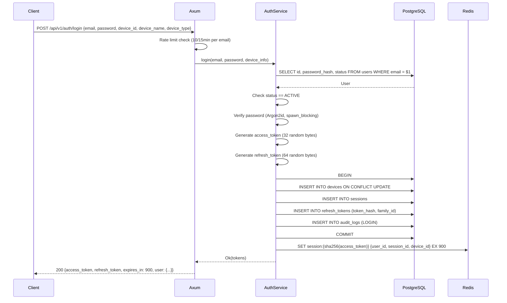
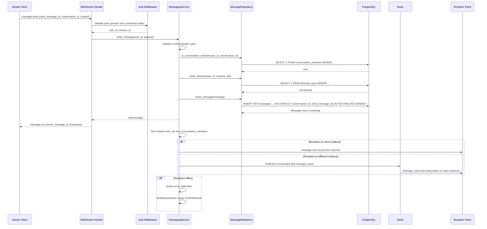
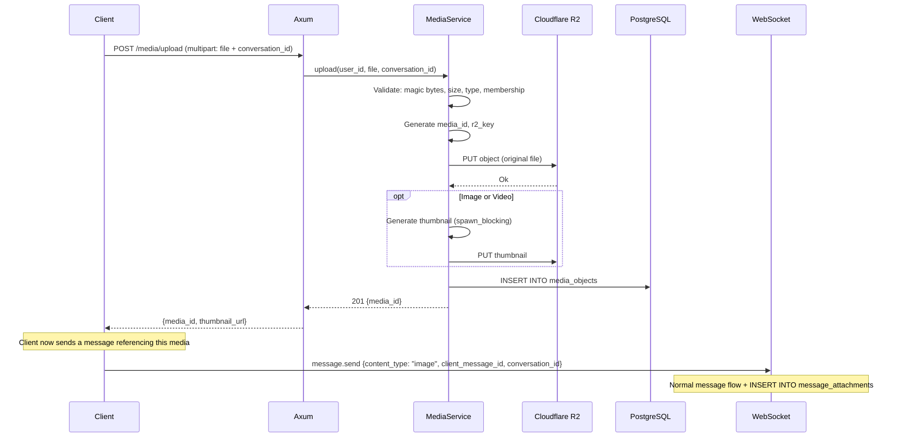
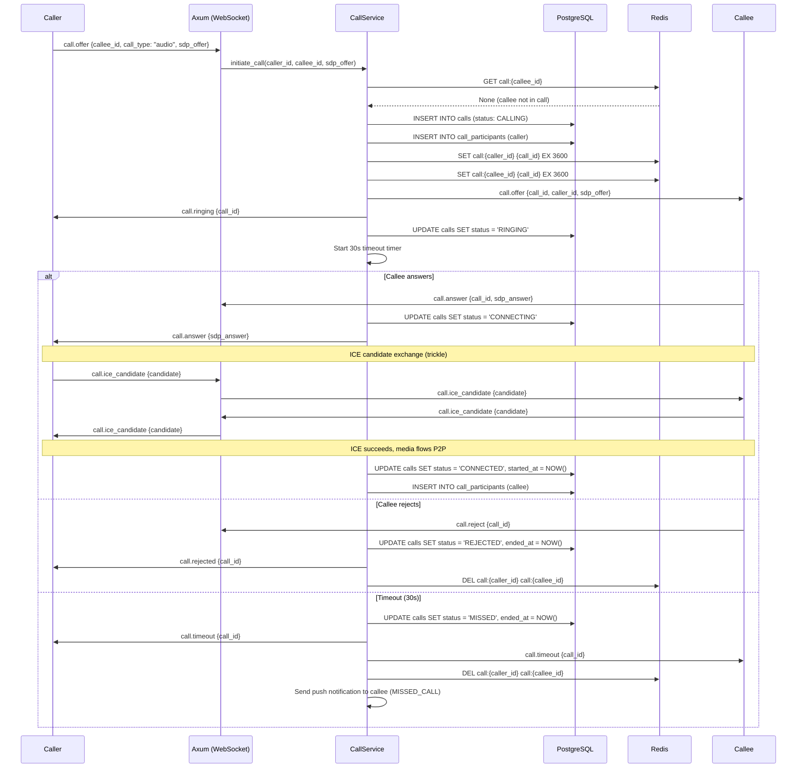
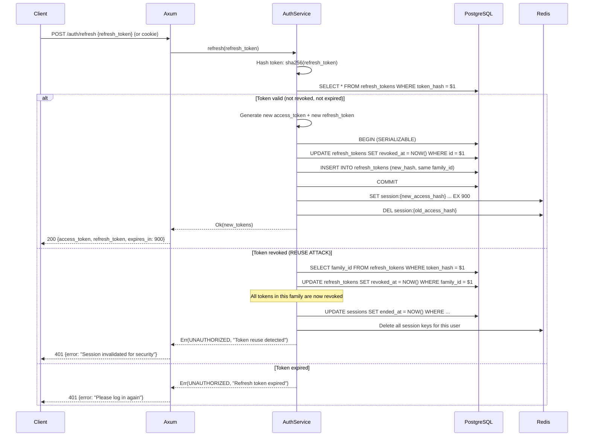
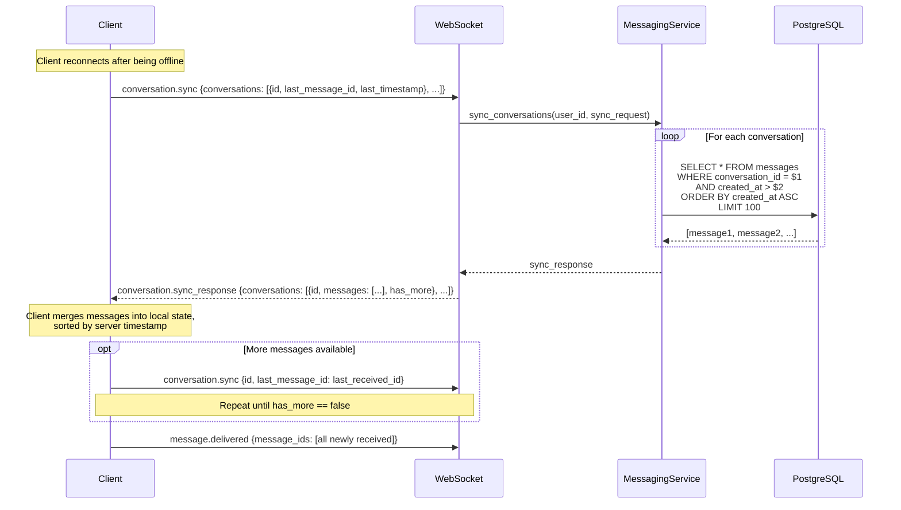

# Data Flow — YBM Connect

| Field             | Value                                      |
|-------------------|--------------------------------------------|
| **Document ID**   | `DOC-ARCH-004`                             |
| **Version**       | `1.0.0`                                    |
| **Status**        | `APPROVED`                                 |
| **Owner**         | Engineering Lead                           |
| **Last Updated**  | 2026-10-02                                 |
| **Related Docs**  | DOC-ARCH-001, DOC-MSG-001, DOC-CALL-003   |
| **Related ADRs**  | ADR-015, ADR-016                           |

---

## 1. User Registration Flow

```mermaid
sequenceDiagram
    participant C as Client
    participant CF as Cloudflare
    participant AX as Axum
    participant SVC as AuthService
    participant REPO as UserRepository
    participant PG as PostgreSQL
    participant EMAIL as Email Service

    C->>CF: POST /api/v1/auth/register
    CF->>AX: Proxy request
    AX->>AX: Rate limit check (5/hr per IP)
    AX->>SVC: register(email, password, display_name)
    SVC->>SVC: Validate email format
    SVC->>SVC: Validate password strength
    SVC->>REPO: find_by_email(email)
    REPO->>PG: SELECT FROM users WHERE email = $1
    PG-->>REPO: None (new user)
    SVC->>SVC: Hash password (Argon2id, spawn_blocking)
    SVC->>REPO: create_user(email, hash, display_name)
    REPO->>PG: BEGIN; INSERT INTO users; INSERT INTO user_profiles; COMMIT
    PG-->>REPO: User
    SVC->>SVC: Generate 6-digit OTP, hash with SHA-256
    SVC->>REPO: create_email_verification(user_id, otp_hash)
    REPO->>PG: INSERT INTO email_verifications
    SVC->>EMAIL: send_otp(email, otp_plaintext)
    EMAIL-->>SVC: Queued (async, best-effort)
    SVC-->>AX: Ok(user)
    AX-->>CF: 201 Created {user_id, status: PENDING_VERIFICATION}
    CF-->>C: Response
```

## 2. Login Flow



## 3. Send Message Flow (Complete)



## 4. Media Upload + Send Flow



## 5. Call Setup Flow (Complete)



## 6. Token Refresh Flow



## 7. Conversation Sync Flow (Reconnection)



---

*Next: [architecture-overview.md](../02-architecture/architecture-overview.md) · [messaging-architecture.md](../06-messaging/messaging-architecture.md)*
