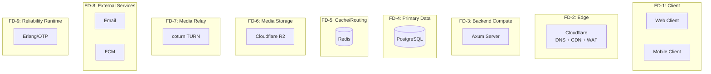

# Failure Domains — YBM Connect

| Field             | Value                                      |
|-------------------|--------------------------------------------|
| **Document ID**   | `DOC-ARCH-009`                             |
| **Version**       | `1.1.0`                                    |
| **Status**        | `APPROVED`                                 |
| **Owner**         | Engineering Lead                           |
| **Last Updated**  | 2026-10-04                                 |
| **Related Docs**  | DOC-ARCH-001, DOC-FT-001, ADR-018         |

---

## Failure Domain Map



## Failure Impact Analysis

| Failure Domain | Component | Impact if Down | User-Visible Effect | Mitigation | Recovery |
|---|---|---|---|---|---|
| **FD-1** | Client crashes | Single user loses connection | App restarts; messages sync on reconnect | Auto-reconnect with backoff, offline queue | Automatic |
| **FD-2** | Cloudflare outage | All traffic blocked | Complete outage for all users | Cloudflare has 100+ PoPs; full outage is extremely rare | Wait for Cloudflare; fallback DNS possible but complex |
| **FD-3** | Axum server crash | All active connections drop | WebSocket disconnects, API errors | Health checks, auto-restart, graceful shutdown saves state | Restart process; clients reconnect; messages sync |
| **FD-4** | PostgreSQL down | No data persistence | Login fails, messages fail to send, history unavailable | Connection pool retry, read replica (future), error responses | Restart PostgreSQL; backend reconnects automatically |
| **FD-5** | Redis down | No real-time routing, no presence, no typing | Messages still persist but don't route in real-time; presence shows stale data; typing indicators stop | System degrades gracefully; messages delivered on sync | Restart Redis; presence rebuilds from WebSocket connections |
| **FD-6** | R2 outage | Media uploads/downloads fail | Cannot send or view media; text messaging unaffected | Return appropriate errors; queue uploads for retry | Wait for R2 recovery; retry uploads |
| **FD-7** | TURN down | Some calls cannot connect | Users behind symmetric NATs cannot call | STUN still works for most connections; display error for failed calls | Restart TURN; clients retry ICE negotiation |
| **FD-8** | Email down | OTPs not delivered | Registration and password reset delayed; existing users unaffected | Queue emails for retry; user can request new OTP | Retry queued emails when service recovers |
| **FD-8** | FCM down | Push notifications not delivered | Backgrounded users miss notification; messages available on app open | Best-effort; messages still delivered via WebSocket on reconnect | Automatic when FCM recovers |
| **FD-9** | Erlang/OTP down | No infrastructure-level supervision, circuit breakers, or dependency monitoring | No user-visible effect; Rust backend continues operating independently. Reliability signals unavailable until Erlang restarts. | Erlang is advisory, not blocking. Rust `/health` and `/ready` endpoints continue independently. | Restart Erlang container; supervision tree reconstructs state from dependency probes |

## Key Design Principle: PostgreSQL is the Source of Truth

The most critical failure domain is FD-4 (PostgreSQL). The system is designed so that:

1. **Every message is persisted to PostgreSQL before being acknowledged.** If Redis fails, messages are not lost.
2. **Every session/token is persisted to PostgreSQL.** If Redis fails, auth still works (slower).
3. **Redis is a performance optimization, not a data store.** Losing Redis degrades performance and real-time features but does NOT lose data.

### Degradation Hierarchy

```
Full System → Normal operation
  ↓ Redis fails
Degraded Mode 1 → No real-time routing (messages via sync), no presence, no typing
  ↓ TURN fails  
Degraded Mode 2 → Some calls fail (behind strict NATs)
  ↓ R2 fails
Degraded Mode 3 → No media (text still works)
  ↓ Email/FCM fails
Degraded Mode 4 → No notifications, no OTP (existing sessions still work)
  ↓ PostgreSQL fails
Critical Failure → System cannot process any state-changing operations
  ↓ Axum crashes
Total Failure → No service available (auto-restart begins)
```

## Blast Radius Containment

| Event | Blast Radius | Contained? |
|-------|-------------|------------|
| Single WebSocket handler panics | That connection only (Tokio task isolation) | ✅ Yes |
| Background worker panics | That worker only; supervisor restarts it | ✅ Yes |
| Database connection pool exhaustion | All database operations block; WebSocket stays alive | ⚠️ Partial |
| Redis connection lost | Real-time routing stops; persistence unaffected | ✅ Yes |
| Axum process crashes | All connections on that instance | ⚠️ Clients reconnect |
| Cloudflare R2 returns errors | Media operations only | ✅ Yes |
| TURN server crashes | Relayed calls only; P2P calls unaffected | ✅ Yes |
| Erlang/OTP reliability service crashes | No reliability signals; Rust unaffected | ✅ Yes |

---

*Next: [scalability.md](scalability.md) · [fault-tolerance.md](../14-fault-tolerance/fault-tolerance.md)*
