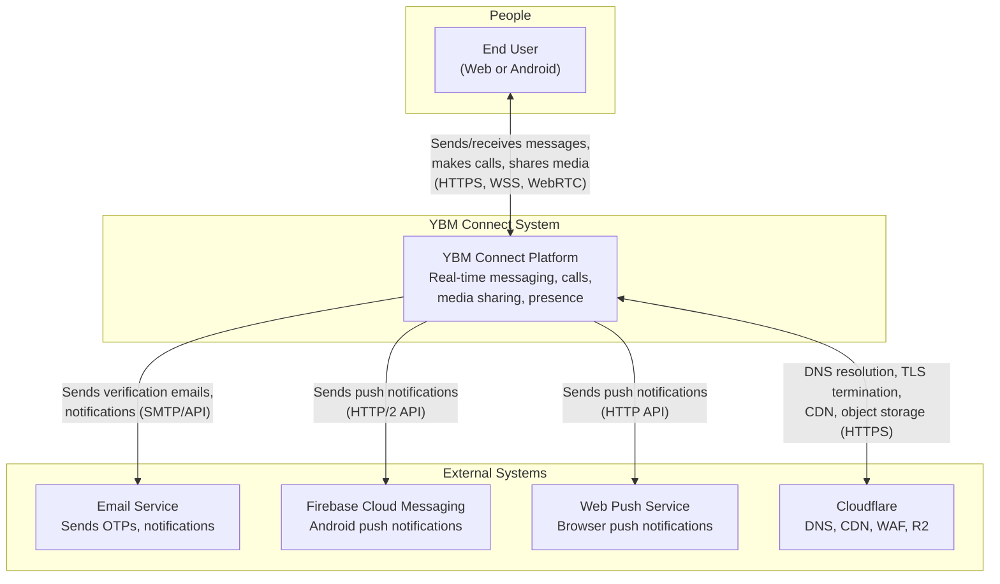

# System Context — YBM Connect

| Field             | Value                                      |
|-------------------|--------------------------------------------|
| **Document ID**   | `DOC-ARCH-002`                             |
| **Version**       | `1.0.0`                                    |
| **Status**        | `APPROVED`                                 |
| **Owner**         | Engineering Lead                           |
| **Last Updated**  | 2026-10-02                                 |
| **Related Docs**  | DOC-ARCH-001, DOC-ARCH-003                 |

---

## System Context Diagram (C4 Level 1)

## System Actors

| Actor | Description | Interaction Pattern |
|-------|-------------|---------------------|
| **End User** | A person using YBM Connect on web (browser) or Android (Expo app). They send/receive messages, make calls, share files, and manage their account. | Synchronous (REST API calls) and asynchronous (WebSocket events, push notifications). WebRTC for media transport during calls. |
| **Email Service** | External SMTP or API service (e.g., Resend, SendGrid, AWS SES) that delivers transactional emails: OTP codes, password reset links, account notifications. | Fire-and-forget with retry. Backend sends email; if delivery fails, backend retries with backoff. User can request a new OTP. |
| **Firebase Cloud Messaging** | Google's push notification infrastructure for Android devices. Receives notification payloads from backend, delivers to device. | Backend sends HTTP/2 POST with device token and payload. FCM handles queuing and delivery to device. Delivery is best-effort (FCM may drop notifications if device is unreachable for too long). |
| **Web Push Service** | W3C Push API service (typically provided by browser vendors). Receives push subscription payloads from backend. | Backend sends VAPID-authenticated HTTP POST. Browser vendor service delivers to client. |
| **Cloudflare** | Edge infrastructure. Provides DNS (domain resolution), CDN (static asset caching), WAF (attack filtering), TLS termination (HTTPS at edge), and R2 (object storage for media). | DNS is transparent. CDN caches static frontend assets. WAF inspects and filters requests. R2 is accessed via S3-compatible API from backend. Media download URLs are signed and served directly from R2 to clients. |

## Data Flows Across Boundaries

| Flow | Source → Destination | Protocol | Data | Security |
|------|---------------------|----------|------|----------|
| User auth | Client → Backend | HTTPS | Credentials, tokens | TLS, rate limiting, Argon2id |
| Message send | Client → Backend | WSS | Message payload | TLS, auth token, input validation |
| Message receive | Backend → Client | WSS | Message payload | TLS, session-scoped |
| Media upload | Client → Backend → R2 | HTTPS | File bytes | TLS, auth, file validation |
| Media download | Client → R2 | HTTPS | File bytes | Signed URL (1h expiry) |
| Call signaling | Client ↔ Backend | WSS | SDP, ICE candidates | TLS, auth |
| Call media | Client ↔ Client (or TURN) | WebRTC (DTLS/SRTP) | Audio/video | DTLS encryption |
| Push notification | Backend → FCM/WebPush | HTTPS | Notification payload | API key / VAPID auth |
| Email | Backend → Email Service | SMTP/HTTPS | OTP content | TLS, API key |
| DB queries | Backend → PostgreSQL | PostgreSQL protocol | SQL, results | TLS or private network |
| Cache ops | Backend → Redis | Redis protocol | Keys, values | Password auth, private network |

## Trust Boundaries

1. **Internet ↔ Cloudflare Edge**: All public traffic enters through Cloudflare. This is the primary DDoS protection and TLS termination point.
2. **Cloudflare Edge ↔ Backend**: Traffic is proxied to the backend origin. Origin IP is not exposed to clients. Connection between Cloudflare and origin uses TLS (Full Strict mode).
3. **Backend ↔ Data Stores**: PostgreSQL and Redis are on a private network. Connections are authenticated and optionally encrypted.
4. **Backend ↔ External Services**: Outbound connections to FCM, email, and Web Push use TLS and API key authentication.

---

*Next: [container-architecture.md](container-architecture.md)*
