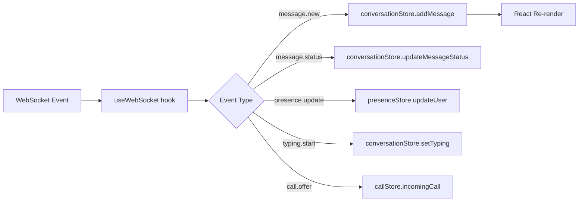

# Frontend — Web Architecture — YBM Connect

| Field             | Value                                      |
|-------------------|--------------------------------------------|
| **Document ID**   | `DOC-FE-001`                               |
| **Version**       | `1.0.0`                                    |
| **Status**        | `APPROVED`                                 |
| **Owner**         | Engineering Lead                           |
| **Last Updated**  | 2026-10-02                                 |
| **Related Docs**  | DOC-FE-002 through 008, DOC-ARCH-001      |

---

## 1. Technology Stack

| Library | Version | Purpose |
|---------|---------|---------|
| **Next.js** | 14+ (App Router) | SSR, routing, API routes |
| **React** | 18+ | UI framework |
| **TypeScript** | 5+ | Type safety |
| **Zustand** | 4+ | State management (lightweight, no boilerplate) |
| **TanStack Query** | 5+ | Server state management, caching, background refresh |
| **Socket.io-client** or native WebSocket | — | Real-time communication |

## 2. Project Structure

```
frontend/web/
├── package.json
├── next.config.js
├── tsconfig.json
├── tailwind.config.ts          # If Tailwind is used (user choice)
├── public/
│   ├── favicon.ico
│   └── manifest.json           # PWA manifest
├── src/
│   ├── app/                    # Next.js App Router
│   │   ├── layout.tsx          # Root layout
│   │   ├── page.tsx            # Landing/redirect
│   │   ├── (auth)/             # Auth route group
│   │   │   ├── login/page.tsx
│   │   │   ├── register/page.tsx
│   │   │   └── verify/page.tsx
│   │   ├── (main)/             # Authenticated route group
│   │   │   ├── layout.tsx      # Sidebar + main area layout
│   │   │   ├── conversations/
│   │   │   │   ├── page.tsx    # Conversation list
│   │   │   │   └── [id]/page.tsx  # Conversation detail
│   │   │   ├── groups/
│   │   │   ├── calls/
│   │   │   ├── settings/
│   │   │   └── profile/
│   │   └── not-found.tsx
│   │
│   ├── components/             # Reusable components
│   │   ├── ui/                 # Primitive UI components (Button, Input, Modal)
│   │   ├── chat/               # Chat-specific (MessageBubble, ConversationItem)
│   │   ├── call/               # Call UI (IncomingCall, CallScreen)
│   │   ├── layout/             # Header, Sidebar, Navigation
│   │   └── auth/               # Auth forms
│   │
│   ├── hooks/                  # Custom React hooks
│   │   ├── useAuth.ts          # Auth state and actions
│   │   ├── useWebSocket.ts     # WebSocket connection management
│   │   ├── useConversation.ts  # Conversation data and actions
│   │   ├── usePresence.ts      # Online/offline tracking
│   │   ├── useTyping.ts        # Typing indicator
│   │   ├── useCall.ts          # WebRTC call management
│   │   └── useMediaUpload.ts   # File upload with progress
│   │
│   ├── stores/                 # Zustand stores
│   │   ├── authStore.ts        # Auth state (user, tokens)
│   │   ├── conversationStore.ts # Conversations and messages
│   │   ├── presenceStore.ts    # Online users
│   │   └── callStore.ts        # Active call state
│   │
│   ├── lib/                    # Non-React utilities
│   │   ├── api.ts              # REST API client (fetch wrapper)
│   │   ├── websocket.ts        # WebSocket client with reconnection
│   │   ├── webrtc.ts           # WebRTC peer connection management
│   │   ├── storage.ts          # Local storage helpers
│   │   ├── notifications.ts    # Web Push API helpers
│   │   └── validators.ts       # Input validation (shared with forms)
│   │
│   └── types/                  # TypeScript type definitions
│       ├── api.ts              # API request/response types
│       ├── websocket.ts        # WebSocket event types
│       ├── models.ts           # Domain types (User, Message, etc.)
│       └── errors.ts           # Error types
```

## 3. State Management

### Architecture

```
Server State (TanStack Query)     Client State (Zustand)
├── User profile                  ├── Auth tokens
├── Conversation list             ├── Current conversation ID
├── Message history               ├── WebSocket connection state
├── Group details                 ├── Call state
├── Call history                  ├── UI state (modals, sidebars)
└── Search results                └── Optimistic message queue
```

**Rule:** Server data (fetched from API) uses TanStack Query. Client-only state uses Zustand. Never duplicate server data in Zustand.

### WebSocket Event → State Update Flow



## 4. Real-Time Client

### WebSocket Manager

```typescript
class WebSocketManager {
  private ws: WebSocket | null = null;
  private reconnectAttempts = 0;
  private maxReconnectDelay = 30000;
  private heartbeatInterval: NodeJS.Timeout | null = null;
  
  async connect(token: string, deviceId: string): Promise<void> {
    const url = `${WS_URL}?token=${token}&device_id=${deviceId}`;
    this.ws = new WebSocket(url);
    
    this.ws.onopen = () => {
      this.reconnectAttempts = 0;
      this.startHeartbeat();
      this.syncConversations();
    };
    
    this.ws.onmessage = (event) => {
      const msg = JSON.parse(event.data);
      this.handleEvent(msg);
    };
    
    this.ws.onclose = (event) => {
      this.stopHeartbeat();
      if (event.code !== 1000) { // Not a clean close
        this.scheduleReconnect();
      }
    };
  }
  
  private scheduleReconnect(): void {
    const delay = Math.min(
      1000 * Math.pow(2, this.reconnectAttempts) + Math.random() * 1000,
      this.maxReconnectDelay
    );
    this.reconnectAttempts++;
    setTimeout(() => this.reconnectWithFreshToken(), delay);
  }
  
  private startHeartbeat(): void {
    this.heartbeatInterval = setInterval(() => {
      this.send({ type: 'auth.ping', request_id: uuid(), timestamp: new Date().toISOString(), payload: {} });
    }, 30000);
  }
}
```

## 5. Offline Support

### Message Outbox Pattern

When the WebSocket is disconnected:
1. Messages are saved to an **outbox** in localStorage
2. UI shows the message with a "sending" indicator (clock icon)
3. When the WebSocket reconnects, outbox messages are sent in order
4. Each message uses its original `client_message_id` (idempotency)
5. On successful ACK, the message is removed from the outbox and status updates to "sent"

### Conversation Sync

On reconnect:
1. Client reads last known message ID per conversation from Zustand/localStorage
2. Sends `conversation.sync` with these cursors
3. Server returns all new messages per conversation
4. Client merges into local state, sorted by server timestamp

## 6. Frontend Security

| Concern | Mitigation |
|---------|-----------|
| XSS | React's default escaping. Never use `dangerouslySetInnerHTML`. CSP headers. |
| Token storage (web) | Access token in memory (Zustand). Refresh token in HttpOnly cookie. |
| CSRF | SameSite=Strict cookies. CSRF tokens for state-changing REST calls. |
| WebSocket auth | Token sent as query parameter during upgrade (over WSS). |
| Media URLs | Signed URLs from backend. No direct R2 keys exposed. |

---

*Next: [mobile-architecture.md](mobile-architecture.md) · [state-management.md](state-management.md)*
