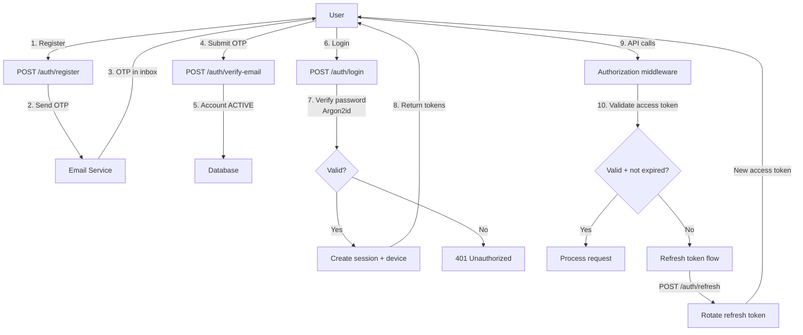
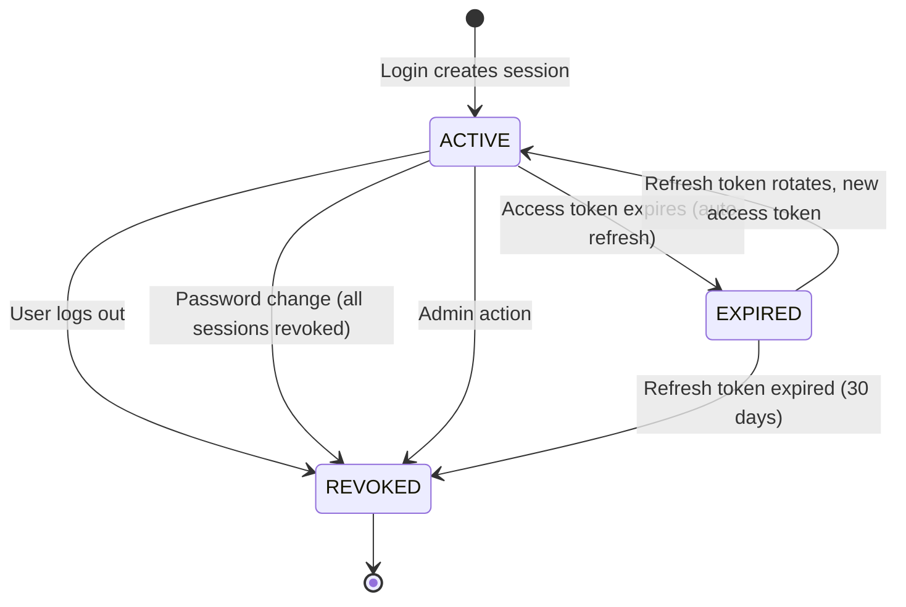
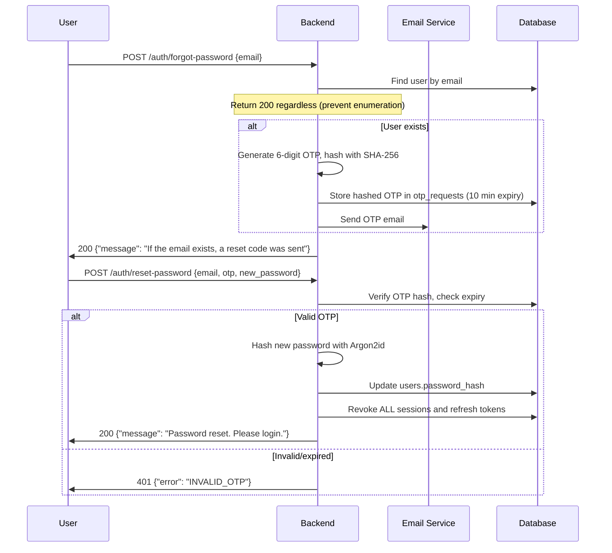

# Authentication Architecture — YBM Connect

| Field             | Value                                      |
|-------------------|--------------------------------------------|
| **Document ID**   | `DOC-AUTH-001`                             |
| **Version**       | `1.0.0`                                    |
| **Status**        | `APPROVED`                                 |
| **Owner**         | Engineering Lead                           |
| **Last Updated**  | 2026-10-02                                 |
| **Related Docs**  | DOC-AUTH-002 through 009, DOC-SEC-001     |
| **Related ADRs**  | ADR-014                                    |
| **Related Reqs**  | AUTH-001 through AUTH-008                  |

---

## 1. Authentication Flow Overview



## 2. Password Hashing

### Argon2id Configuration

```rust
use argon2::{Argon2, PasswordHasher, PasswordVerifier};
use argon2::password_hash::{SaltString, rand_core::OsRng};

let argon2 = Argon2::new(
    argon2::Algorithm::Argon2id,    // Hybrid: side-channel + GPU resistance
    argon2::Version::V0x13,         // Latest version
    argon2::Params::new(
        65536,  // 64 MB memory
        3,      // 3 iterations
        4,      // 4 parallelism lanes
        None,   // Default output length (32 bytes)
    )?,
);

// Hash password
let salt = SaltString::generate(&mut OsRng);
let hash = argon2.hash_password(password.as_bytes(), &salt)?;
// Store hash.to_string() in database

// Verify password
let parsed_hash = PasswordHash::new(&stored_hash)?;
argon2.verify_password(password.as_bytes(), &parsed_hash)?;
// Returns Ok(()) if match, Err if not
```

### Why Argon2id Over bcrypt/scrypt?
- **Memory-hard:** Requires 64MB of RAM per hash, making GPU-based brute force expensive
- **Time-hard:** 3 iterations provide adequate computational cost
- **Side-channel resistant:** The `id` variant combines data-dependent and data-independent addressing
- **OWASP recommended:** Current OWASP recommendation for password hashing
- **Tunable:** Parameters can be adjusted as hardware improves

## 3. Token Architecture

### Access Token

| Property | Value |
|----------|-------|
| Format | Opaque (32 random bytes, base64url encoded) |
| Lifetime | 15 minutes |
| Storage (server) | Redis: `session:{sha256(token)}` → `{user_id, session_id, device_id}` |
| Storage (client, web) | In-memory only (JavaScript variable) |
| Storage (client, mobile) | Secure storage (Expo SecureStore) |
| Sent via | `Authorization: Bearer {token}` header |
| Revocation | Delete Redis key (immediate) |

### Refresh Token

| Property | Value |
|----------|-------|
| Format | Opaque (64 random bytes, base64url encoded) |
| Lifetime | 30 days |
| Storage (server) | PostgreSQL: `refresh_tokens` table (sha256 hash, never plaintext) |
| Storage (client, web) | HttpOnly, Secure, SameSite=Strict cookie |
| Storage (client, mobile) | Secure storage (Expo SecureStore) |
| Sent via | Cookie (web) or request body (mobile) |
| Rotation | New token issued on each use; old token revoked |
| Reuse detection | Via `family_id` — if a revoked token is used, entire family is revoked |

### Why NOT JWT?

| Concern | JWT | Opaque Token (our choice) |
|---------|-----|--------------------------|
| Revocation | Cannot revoke before expiry without a server-side blocklist (defeats the purpose of stateless JWT) | Delete from Redis/DB → immediately invalid |
| Size | ~300-500 bytes (header + payload + signature) | ~44 bytes (32 bytes base64url) |
| CPU cost | Must parse, verify signature on every request | Must do a Redis lookup on every request |
| Information leak | Payload is base64-encoded (readable without key) | No information in the token |
| Complexity | Key management, algorithm selection, library vulnerabilities | Simple random bytes |

Since we need server-side state anyway (for immediate revocation on logout, session management, multi-device), opaque tokens are simpler and equally performant.

## 4. Session Management

### Session Lifecycle



### Multi-Device

A user can have multiple active sessions, one per device:

```
User Alice:
  ├── Session 1: Chrome on Windows (device_id: abc)
  ├── Session 2: Android App (device_id: def)
  └── Session 3: Firefox on Mac (device_id: ghi)
```

Each session has its own access token and refresh token. Revoking one session does not affect others (unless "Logout all devices" is used).

## 5. Device Management

### Device Registration

On first login from a new device:
1. Client generates a persistent `device_id` (UUID v4, stored in localStorage/SecureStore)
2. Client sends `device_id` + device metadata (name, type) during login
3. Server creates a `devices` record and a `sessions` record
4. If the `device_id` already exists for this user, the existing device record is updated

### Push Token Management

```
POST /api/v1/devices/{device_id}
{
  "push_token": "fcm_token_or_web_push_subscription",
  "push_provider": "FCM"
}
```

Push tokens are updated whenever:
- The app receives a new FCM/Web Push token (token refresh callback)
- The user logs in on a new device

## 6. Account Recovery

### Password Reset Flow



### Security Considerations
- Password reset revokes ALL sessions (forces re-login on all devices)
- OTP is hashed (SHA-256) before storage — if the database is compromised, OTPs are not readable
- Rate limited: 3 requests per email per hour
- No account enumeration: same response regardless of whether the email exists

---

*Next: [authorization.md](authorization.md) · [sessions.md](sessions.md) · [device-management.md](device-management.md)*
