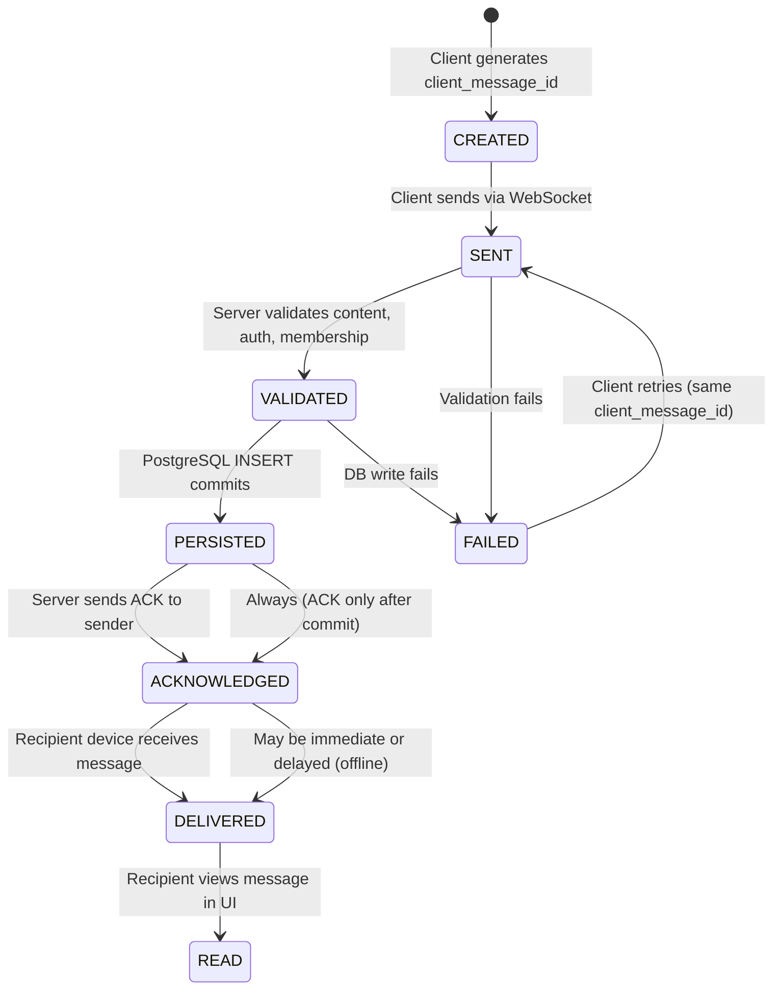
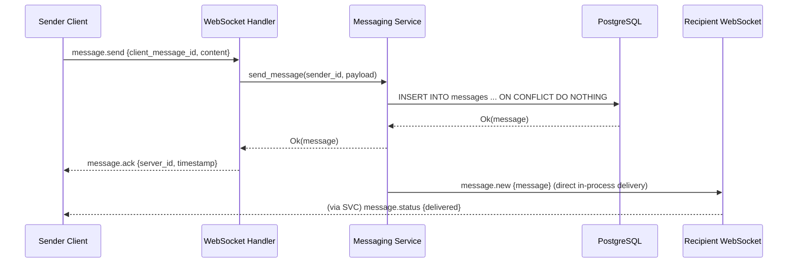
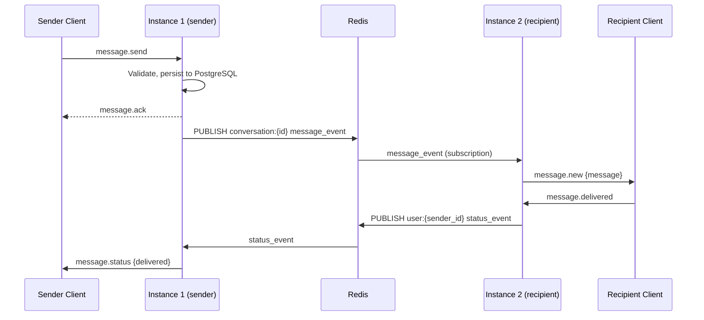
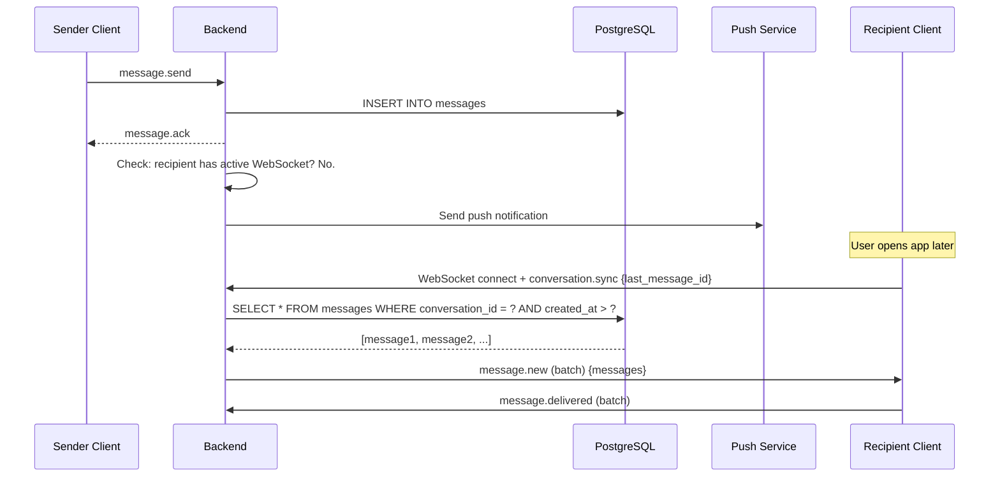
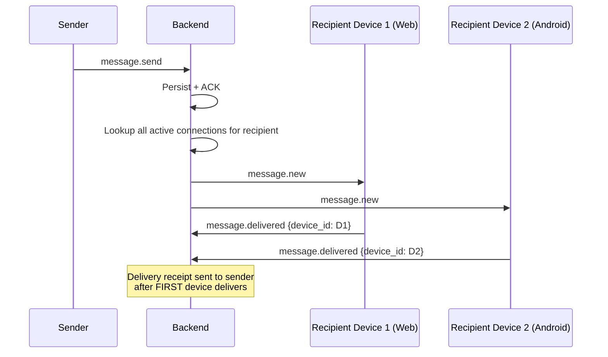
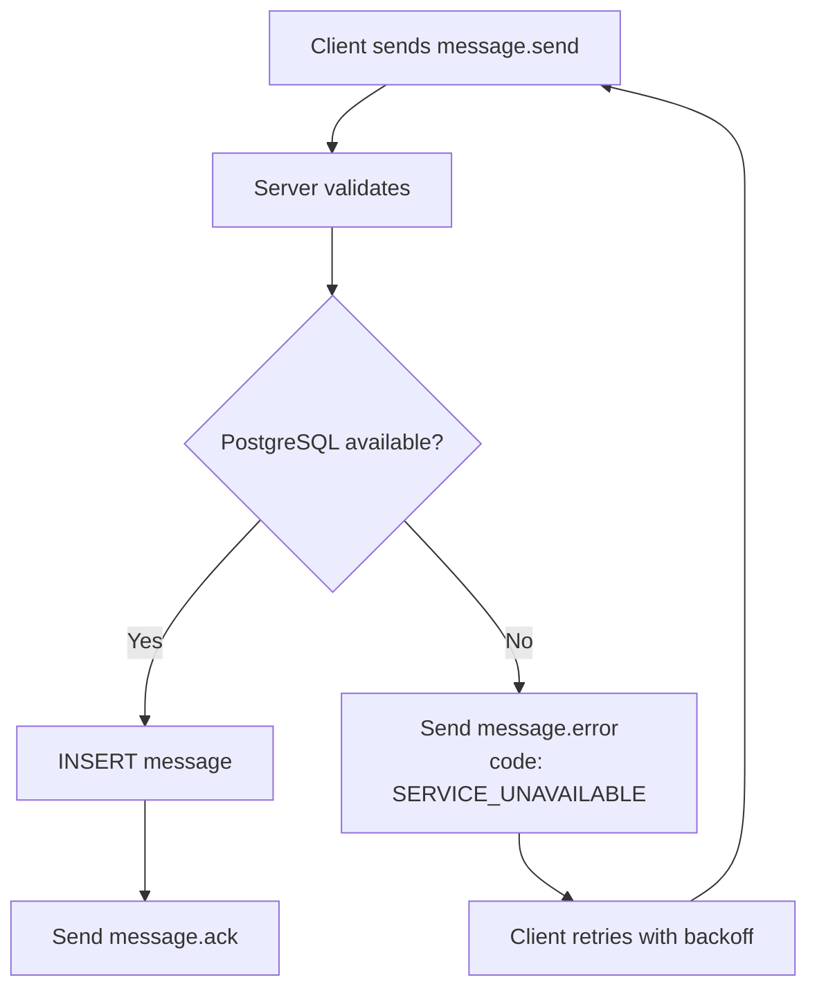
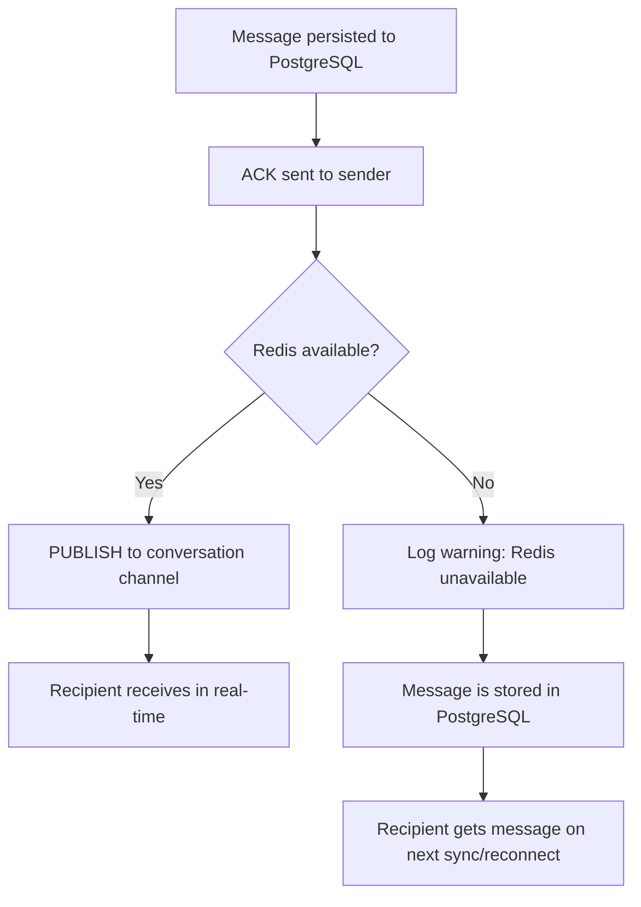

# Messaging Architecture — YBM Connect

| Field             | Value                                      |
|-------------------|--------------------------------------------|
| **Document ID**   | `DOC-MSG-001`                              |
| **Version**       | `1.0.0`                                    |
| **Status**        | `APPROVED`                                 |
| **Owner**         | Engineering Lead                           |
| **Last Updated**  | 2026-10-02                                 |
| **Related Docs**  | DOC-MSG-002 through 014, DOC-DB-002, DOC-API-003 |
| **Related ADRs**  | ADR-015, ADR-016                           |
| **Related Reqs**  | MSG-001 through MSG-009                    |

---

## 1. Message Lifecycle

Every message in YBM Connect passes through a defined state machine. State transitions are deterministic and occur at specific system boundaries.

### Message State Machine



### State Definitions

| State | Where | Trigger | Guarantee |
|-------|-------|---------|-----------|
| **CREATED** | Client | User types message, client generates UUID v7 as `client_message_id` | Client has a local identifier for this message |
| **SENT** | Network | Client sends `message.send` event over WebSocket | Message is in transit; no server guarantee yet |
| **VALIDATED** | Server (Service Layer) | Server validates: content length, content type, user is conversation member, input sanitized | Message meets all business rules |
| **PERSISTED** | Database | PostgreSQL transaction commits: `INSERT INTO messages ...` | **Message is durable.** Even if server crashes after this point, the message exists. |
| **ACKNOWLEDGED** | Server → Client | Server sends `message.ack` to sender with `server_message_id` and server timestamp | Sender knows the server accepted the message |
| **DELIVERED** | Server → Recipient Client | Recipient's WebSocket receives `message.new` | Recipient's device has the message (may not be viewed yet) |
| **READ** | Recipient Client → Server | Recipient's UI reports the message as viewed | Sender can see "read" status |
| **FAILED** | Server → Client | Validation error, DB error, or authorization failure | Sender receives `message.error` with reason code |

### Critical Design Decision: ACK After Commit

The `message.ack` event is sent to the sender **only after** the PostgreSQL transaction commits. This is the fundamental durability guarantee:

```
❌ WRONG: ACK → then persist (message can be lost if crash between ACK and persist)
✅ RIGHT: Persist → then ACK (if crash after persist but before ACK, client retries → idempotency check → returns existing message)
```

## 2. Client-Generated Message ID

### What is `client_message_id`?

A UUID v7 generated by the sender's client **before** the message is sent. It is included in every `message.send` event.

### Why UUID v7?

UUID v7 is time-ordered (embeds a Unix timestamp), which means:
1. Messages created in sequence have naturally ordered IDs
2. Database indexes on UUID v7 have better locality than random UUID v4
3. No server round-trip needed to obtain an ID before sending

### Why It Exists

| Problem | How `client_message_id` Solves It |
|---------|----------------------------------|
| **Network timeout during send** | Client retries with the same `client_message_id`. Server detects the duplicate via UNIQUE constraint and returns the existing message. No double-post. |
| **Client crash after send, before ACK** | On restart, client can check if the message was persisted by querying with `client_message_id`. |
| **Optimistic UI** | Client can display the message immediately (with CREATED state) and update it when ACK arrives, using `client_message_id` as the key. |
| **Multi-device send tracking** | Each device generates its own `client_message_id`, preventing conflicts between devices. |

### Idempotency Implementation

```sql
INSERT INTO messages (id, client_message_id, conversation_id, sender_id, content, content_type)
VALUES ($1, $2, $3, $4, $5, $6)
ON CONFLICT (conversation_id, client_message_id) DO NOTHING
RETURNING *;
```

If `RETURNING` returns no rows (conflict), the service layer does:

```sql
SELECT * FROM messages WHERE conversation_id = $1 AND client_message_id = $2;
```

And returns the existing message as the ACK. The client cannot distinguish between a new message and a deduplicated retry — both look like successful sends.

## 3. Message Delivery Flow

### 3.1 Online Recipient (Same Backend Instance)



When sender and recipient are connected to the **same** Axum instance, delivery is an in-process channel send. No Redis needed.

### 3.2 Online Recipient (Different Backend Instance)



Redis pub/sub is the cross-instance routing mechanism. Each backend instance subscribes to Redis channels for all conversations that have members connected to that instance.

### 3.3 Offline Recipient



Messages are **always persisted to PostgreSQL first**. They don't live in Redis or a queue. This means:
- If Redis is down, messages are still stored
- If the server crashes, messages are still stored
- If the recipient is offline for days, messages are still available

### 3.4 Multi-Device Delivery

When a user has multiple devices (e.g., phone + browser), the message must be delivered to **all** active devices:



The sender sees "delivered" as soon as **any** of the recipient's devices receives the message.

## 4. Message Ordering

### Ordering Strategy (ADR-016)

Messages are ordered by **server-assigned timestamp** (`messages.created_at`), NOT by `client_message_id` or client timestamps.

**Why server timestamp?**
- Client clocks can be wrong, skewed, or manipulated
- Server timestamp provides a single source of truth
- PostgreSQL `NOW()` is monotonic within a single instance

**Within a single conversation:**
- Messages are ordered by `created_at DESC` for display
- Pagination uses cursor-based pagination on `(created_at, id)` to handle timestamp collisions

**Across conversations:**
- Each conversation has an independent message stream
- Conversation list is ordered by most recent message timestamp

### What Happens with Concurrent Messages?

If two users send messages at the exact same millisecond:
1. Both messages are persisted with the same `created_at` value
2. The secondary sort key is `id` (UUID, which provides a stable arbitrary order)
3. Both messages are delivered to all participants in this stable order
4. This is acceptable because sub-millisecond ordering between different senders has no meaningful user impact

### What Happens with Out-of-Order Delivery?

If the client receives `message_B` before `message_A` (due to network conditions):
1. Client inserts both into its local message list sorted by server timestamp
2. UI renders in correct order regardless of delivery order
3. No server-side correction needed

## 5. Failure Scenarios

### 5.1 Database Failure During Message Send



**Key:** No ACK is sent if the database write fails. The client retries with the same `client_message_id`, so idempotency is maintained when the database recovers.

### 5.2 Redis Failure During Message Routing



**Key:** Redis failure does NOT cause message loss. It degrades real-time delivery to sync-based delivery.

### 5.3 WebSocket Failure During Delivery

If the recipient's WebSocket disconnects between message persistence and delivery:
1. The `PUBLISH` to Redis still happens
2. The Redis subscriber on the recipient's instance sees no active connection
3. The message remains in PostgreSQL
4. When the client reconnects, it sends `conversation.sync` and receives all missed messages

### 5.4 Server Crash After Persist, Before ACK

1. Message is persisted (committed to PostgreSQL)
2. Server crashes before sending ACK
3. Client's WebSocket disconnects
4. Client reconnects, retries the same message (same `client_message_id`)
5. Server finds the message via idempotency check
6. Server returns the existing message as ACK
7. No duplicate message

### 5.5 Client Crash After Send, Before ACK

1. Client sends message, then crashes
2. Server processes and persists the message normally
3. Server sends ACK to dead WebSocket (fails silently)
4. Client restarts, reconnects, sends `conversation.sync`
5. The message appears in the sync results
6. Client reconciles with its local outbox

## 6. Message Size Limits

| Content Type | Max Size | Rationale |
|---|---|---|
| Text | 4,096 UTF-8 characters | Balance between expressiveness and performance |
| System message | 500 characters | Auto-generated, short |
| Reaction emoji | 20 characters | Single emoji or shortcode |
| Edit content | 4,096 UTF-8 characters | Same as original |

Media size limits are defined in [media-architecture.md](../08-media/media-architecture.md).

## 7. Message Deletion

Deletion is a **soft delete**:
1. `messages.deleted_at` is set to the current timestamp
2. `messages.content` is set to NULL
3. The message row remains for referential integrity (receipts, reactions reference it)
4. Media attachments are scheduled for R2 cleanup (background worker)
5. All conversation members receive `message.deleted` event
6. Clients replace the message content with "This message was deleted"

**Why soft delete?**
- Hard delete would cascade to receipts, reactions, and break reply chains
- Soft delete preserves the message's existence in the timeline
- Eventual hard purge can run as a background job after a retention period

---

*Next: [message-lifecycle.md](message-lifecycle.md) · [message-delivery.md](message-delivery.md) · [idempotency.md](idempotency.md)*
