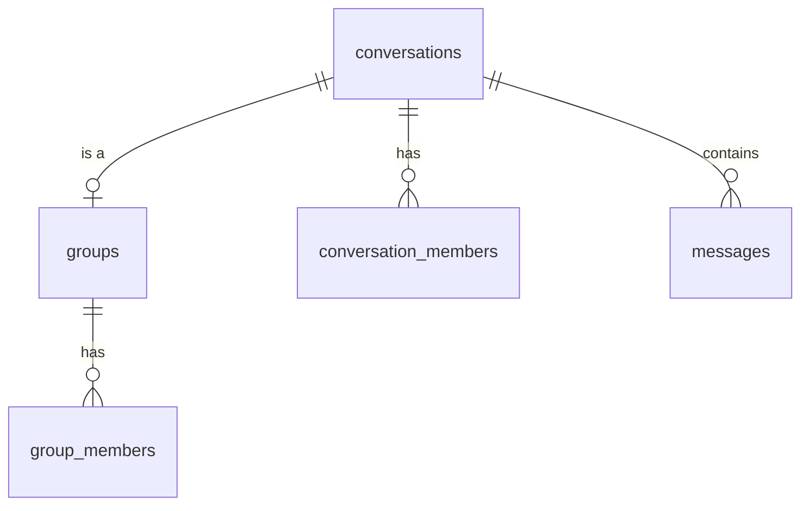

# Groups Architecture — YBM Connect

| Field             | Value                                      |
|-------------------|--------------------------------------------|
| **Document ID**   | `DOC-GRP-001`                              |
| **Version**       | `1.0.0`                                    |
| **Status**        | `APPROVED`                                 |
| **Owner**         | Engineering Lead                           |
| **Last Updated**  | 2026-10-02                                 |
| **Related Docs**  | DOC-MSG-001, DOC-DB-002                   |
| **Related Reqs**  | GRP-001 through GRP-006                   |

---

## 1. Group Model

A group IS a conversation with extra metadata (name, description, avatar) and explicit role-based membership.

When a group is created:
1. A `conversations` record is created with `conversation_type = 'GROUP'`
2. A `groups` record is created linking to that conversation
3. `conversation_members` entries are created for all initial members
4. `group_members` entries are created with roles (creator → ADMIN)

## 2. Role Hierarchy

| Role | Can Send Messages | Can Add Members | Can Remove Members | Can Edit Group Info | Can Delete Group | Can Change Roles |
|------|---|---|---|---|---|---|
| **ADMIN** | ✅ | ✅ | ✅ (except other admins) | ✅ | ✅ | ✅ |
| **MEMBER** | ✅ | ❌ | ❌ | ❌ | ❌ | ❌ |

### Authorization Matrix

| Action | Required Role | Additional Checks |
|--------|--------------|-------------------|
| Send message | MEMBER or ADMIN | User is active member (not left) |
| View messages | MEMBER or ADMIN | User is active member |
| Add member | ADMIN | Target not already member, not blocked by target |
| Remove member | ADMIN | Cannot remove self (use leave), cannot remove other admins |
| Leave group | MEMBER or ADMIN | If last admin leaves, promote longest-serving member |
| Edit group name/description/avatar | ADMIN | — |
| Delete group | ADMIN | Soft-deletes group, notifies all members |
| Change member role | ADMIN | Cannot demote self if only admin |

## 3. Group Limits

| Limit | Value | Rationale |
|-------|-------|-----------|
| Max members per group | 256 | Performance (message fan-out), UX |
| Max groups per user | 100 | Prevent abuse |
| Min members | 2 | A group of 1 has no purpose (use direct conversation) |
| Group name length | 3-100 chars | UX |
| Group description length | 0-500 chars | UX |
| Max admins | No limit | — |

## 4. System Messages

When group state changes, a system message is inserted into the conversation:

| Event | System Message | content_type |
|-------|---------------|--------------|
| Group created | "Alice created the group" | `system` |
| Member added | "Alice added Bob to the group" | `system` |
| Member removed | "Alice removed Bob from the group" | `system` |
| Member left | "Bob left the group" | `system` |
| Group name changed | "Alice changed the group name to 'New Name'" | `system` |
| Role changed | "Alice made Bob an admin" | `system` |

System messages have `sender_id = NULL` or a special system user ID. They appear in the conversation history like regular messages but are rendered differently by clients.

---

*Next: [group-messaging.md](group-messaging.md) · [group-admin.md](group-admin.md)*
