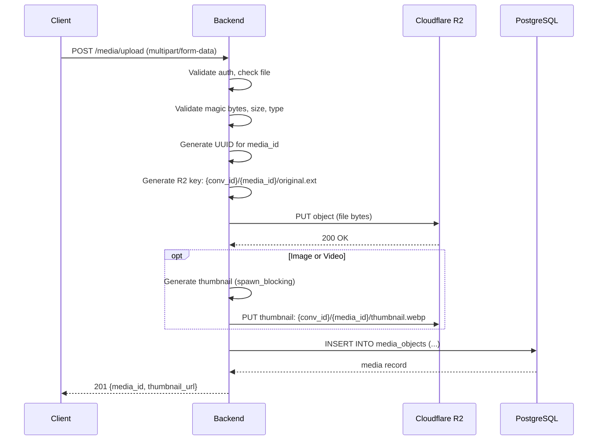
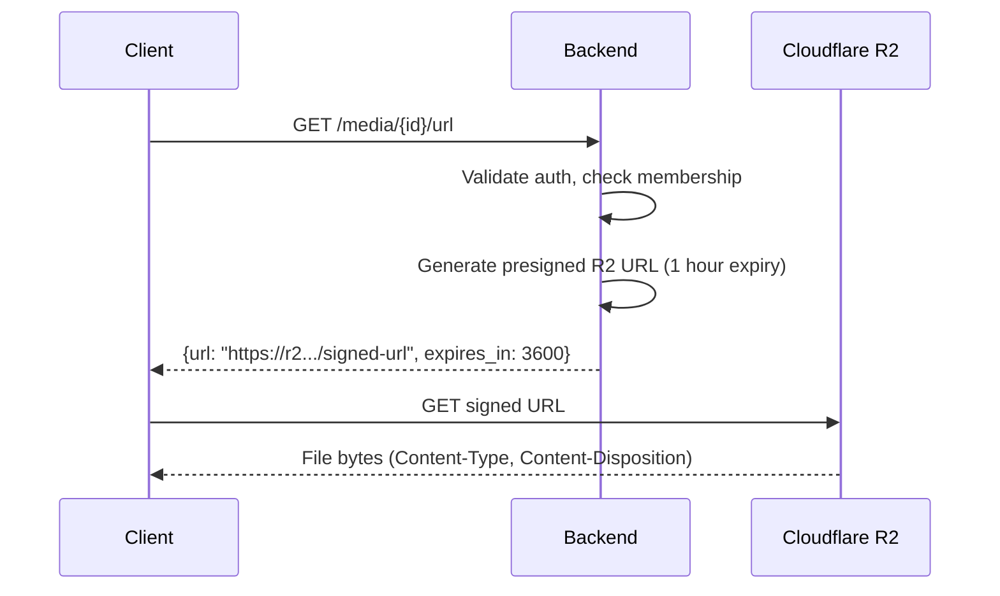

# Media Architecture — YBM Connect

| Field             | Value                                      |
|-------------------|--------------------------------------------|
| **Document ID**   | `DOC-MEDIA-001`                            |
| **Version**       | `1.0.0`                                    |
| **Status**        | `APPROVED`                                 |
| **Owner**         | Engineering Lead                           |
| **Last Updated**  | 2026-10-02                                 |
| **Related Docs**  | DOC-CF-001, DOC-DB-002, DOC-SEC-001       |
| **Related Reqs**  | MEDIA-001 through MEDIA-005               |

---

## 1. Upload Flow



## 2. File Validation

### Allowed Types

| Media Type | Extensions | MIME Types | Max Size | Thumbnail? |
|---|---|---|---|---|
| **Image** | `.jpg`, `.jpeg`, `.png`, `.gif`, `.webp`, `.heic` | `image/jpeg`, `image/png`, `image/gif`, `image/webp`, `image/heic` | 10 MB | ✅ Yes (300x300 WebP) |
| **Video** | `.mp4`, `.mov`, `.webm` | `video/mp4`, `video/quicktime`, `video/webm` | 50 MB | ✅ Yes (first frame) |
| **Document** | `.pdf`, `.doc`, `.docx`, `.xls`, `.xlsx`, `.ppt`, `.pptx`, `.txt`, `.csv` | Various | 25 MB | ❌ No |
| **Voice** | `.ogg`, `.opus`, `.m4a`, `.webm` | `audio/ogg`, `audio/opus`, `audio/mp4`, `audio/webm` | 5 MB | ❌ No |

### Validation Steps

1. **File size check** — Reject before reading body if Content-Length exceeds limit
2. **Magic byte validation** — Read first 8-12 bytes, verify they match expected file format
3. **Extension check** — File extension must match magic bytes (prevent MIME spoofing)
4. **Content-Type check** — Must be in the allowed MIME types list
5. **Filename sanitization** — Strip path components, replace special characters, limit length

### Blocked
- Executables (`.exe`, `.bat`, `.cmd`, `.sh`, `.msi`)
- Scripts (`.js`, `.py`, `.rb`, `.php`)
- Archives (`.zip`, `.tar`, `.rar`) — these can contain executables
- System files (`.dll`, `.sys`, `.inf`)

## 3. Thumbnail Generation

For images:
- Resize to fit within 300×300 pixels (preserving aspect ratio)
- Convert to WebP format (smaller file size)
- Run in `spawn_blocking` (CPU-bound image processing)

For videos:
- Extract first frame using `ffmpeg` (if available) or skip thumbnail
- Resize to 300×300 WebP

### EXIF Stripping

All image uploads have EXIF metadata stripped before storage. This prevents:
- GPS location leakage
- Camera/device identification
- Personal metadata exposure

## 4. Download Flow



The backend NEVER proxies file content. It generates signed URLs and the client downloads directly from R2.

## 5. Storage Structure

```
R2 Bucket: ybm-connect-media/
├── {conversation_id}/
│   ├── {media_id_1}/
│   │   ├── original.jpg
│   │   └── thumbnail.webp
│   ├── {media_id_2}/
│   │   └── original.pdf
│   └── ...
├── avatars/
│   ├── {user_id}.webp
│   └── ...
└── groups/
    ├── {group_id}.webp
    └── ...
```

## 6. Media Cleanup

When a message with attachments is deleted:
1. Message is soft-deleted (content → NULL, deleted_at → NOW())
2. A cleanup task is enqueued
3. CleanupWorker deletes R2 objects for the media
4. Media_objects record is marked as deleted

---

*Next: [upload.md](upload.md) · [thumbnails.md](thumbnails.md)*
