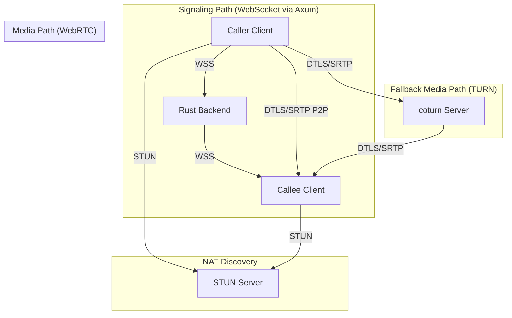
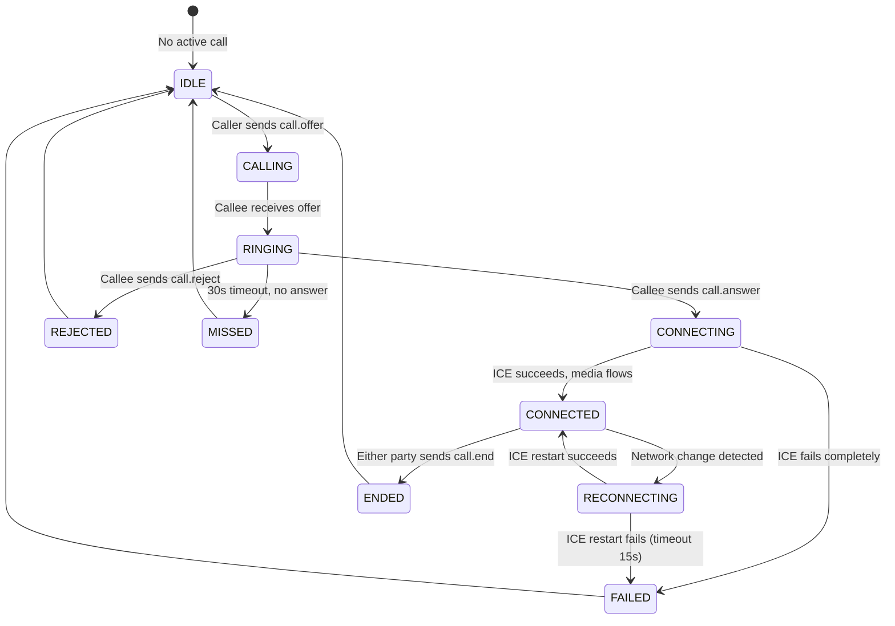
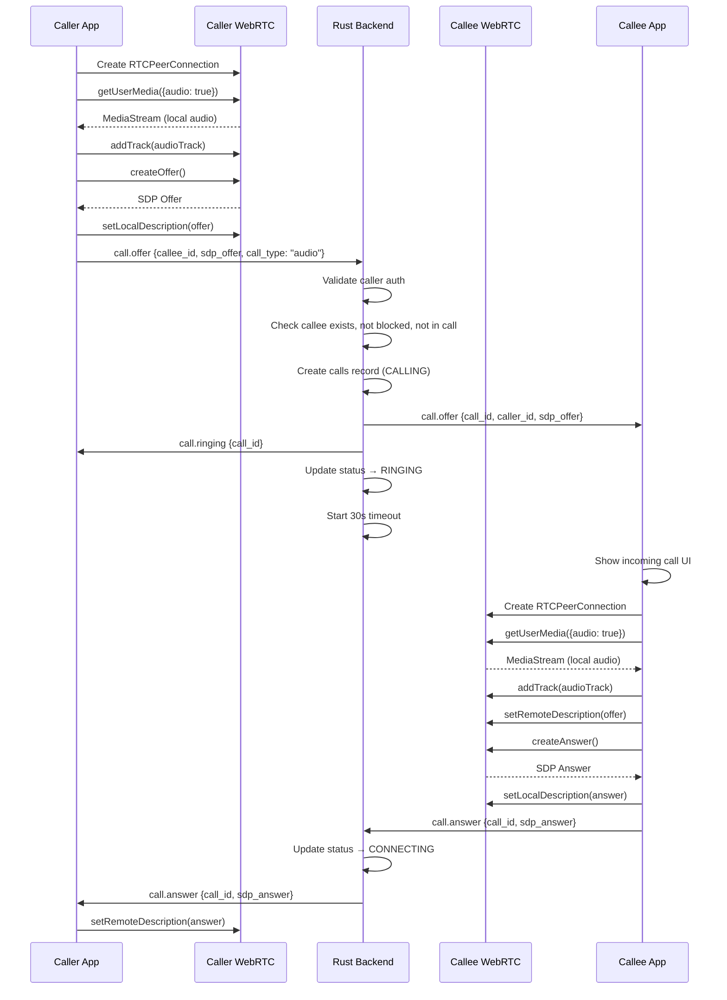
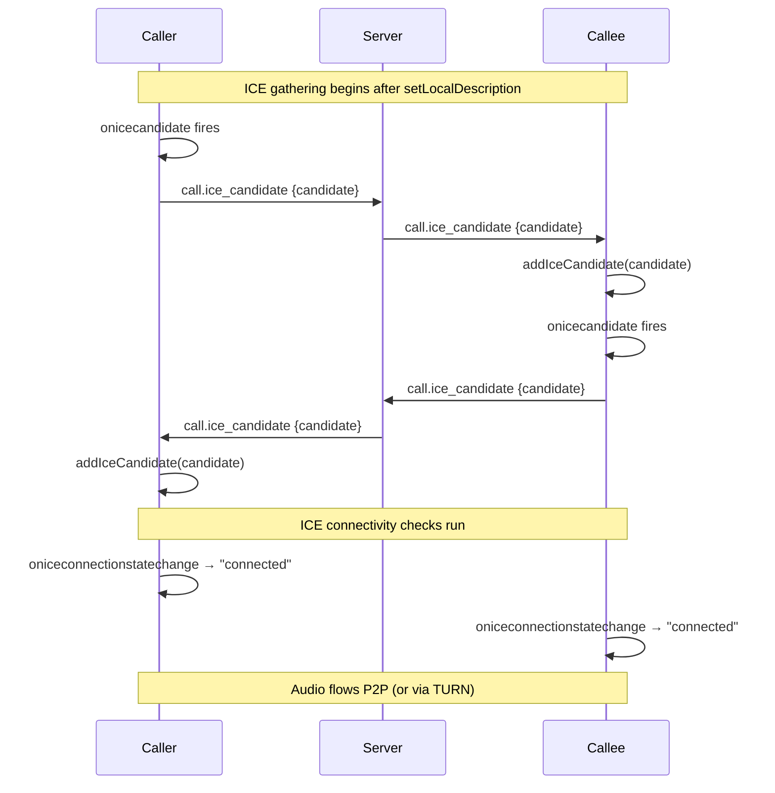
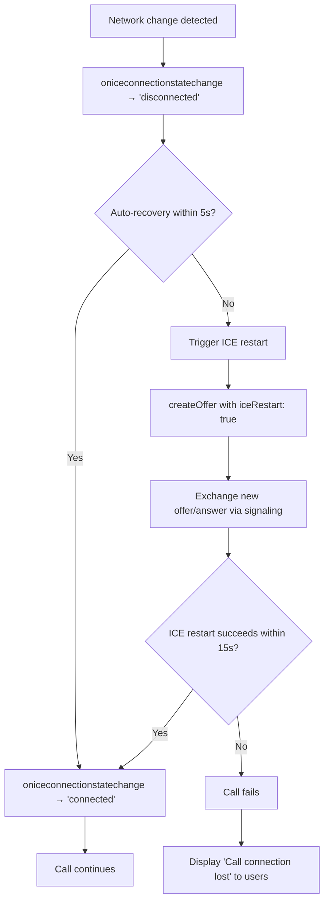
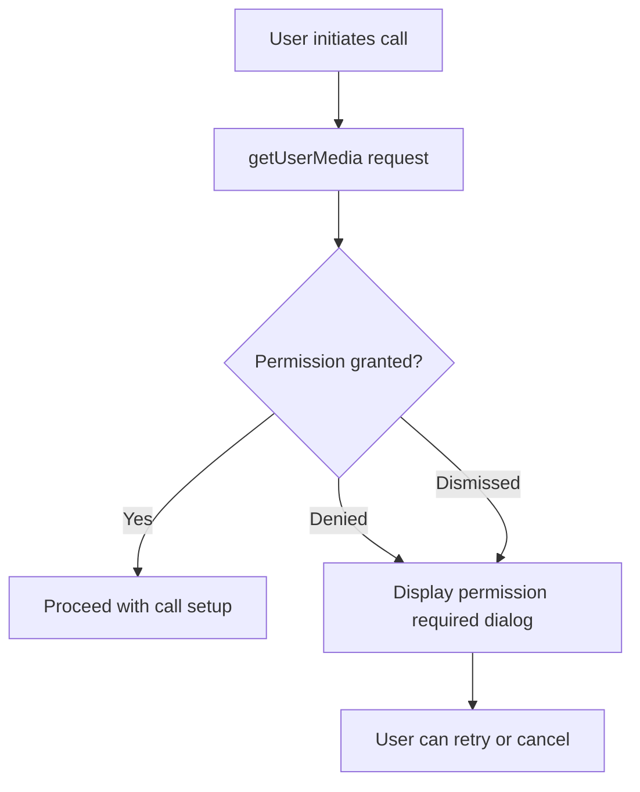

# WebRTC Architecture — YBM Connect

| Field             | Value                                      |
|-------------------|--------------------------------------------|
| **Document ID**   | `DOC-CALL-003`                             |
| **Version**       | `1.0.0`                                    |
| **Status**        | `APPROVED`                                 |
| **Owner**         | Engineering Lead                           |
| **Last Updated**  | 2026-10-02                                 |
| **Related Docs**  | DOC-CALL-001, DOC-CALL-004, DOC-CALL-005  |
| **Related ADRs**  | ADR-007, ADR-008                           |
| **Related Reqs**  | CALL-001 through CALL-006                  |

---

## 1. Architecture: Signaling vs. Media

**Critical distinction:**
- **Signaling** (SDP, ICE candidates, call control) flows through the **Rust backend** via WebSocket.
- **Media** (audio, video streams) flows **directly between peers** (P2P) or through the **TURN server**.

The Rust backend **never touches media data**. It only relays signaling messages.



## 2. Call State Machine



### State Definitions

| State | Location | Duration | Server Action |
|-------|----------|----------|---------------|
| **IDLE** | Client | Indefinite | — |
| **CALLING** | Server | Max 5s (until callee is notified) | Create `calls` record, forward offer to callee |
| **RINGING** | Server | Max 30s | Timer running; send push notification if callee is offline |
| **CONNECTING** | Both clients | Max 30s | Relay ICE candidates between peers |
| **CONNECTED** | Both clients | Until ended | Record `started_at` timestamp |
| **RECONNECTING** | Both clients | Max 15s | ICE restart in progress |
| **ENDED** | Server | — | Record `ended_at`, calculate duration |
| **REJECTED** | Server | — | Record status, notify caller |
| **MISSED** | Server | — | Record status, send push to callee |
| **FAILED** | Server | — | Record status and failure reason |

## 3. Signaling Flow (Detailed)

### 3.1 Offer/Answer Exchange



### 3.2 ICE Candidate Exchange (Trickle ICE)



## 4. STUN and TURN

### STUN (Session Traversal Utilities for NAT)

**Purpose:** Discovers the client's public IP address and port as seen from outside the NAT.

**How it works:**
1. Client sends a STUN Binding Request to the STUN server
2. STUN server responds with the client's public IP:port
3. Client uses this as an ICE candidate (server-reflexive candidate)

**STUN is sufficient when:** Both peers are behind simple NATs (cone NAT) where the mapped port is consistent.

**STUN fails when:** Either peer is behind a symmetric NAT (common in corporate networks), where the mapped port changes for each destination.

### TURN (Traversal Using Relays around NAT)

**Purpose:** Provides a relay server that forwards media when direct P2P is impossible.

**How it works:**
1. Client sends TURN Allocate request to the TURN server (with credentials)
2. TURN server allocates a relay address
3. Client uses this relay address as an ICE candidate (relay candidate)
4. If direct candidates fail, ICE falls back to the relay candidate
5. Media flows: Client A → TURN → Client B

**TURN is used when:**
- Both peers are behind symmetric NATs
- Corporate firewalls block UDP entirely
- One peer is on a very restrictive network

**Cost:** TURN relays all media traffic through the server, consuming bandwidth. Estimated ~100 Kbps per audio call, ~1 Mbps per video call.

### ICE Configuration

```javascript
const iceConfig = {
  iceServers: [
    { urls: "stun:stun.ybmconnect.com:3478" },
    {
      urls: "turn:turn.ybmconnect.com:3478",
      username: "time-limited-username",  // Generated by backend
      credential: "time-limited-credential"  // HMAC-based, short-lived
    }
  ],
  iceTransportPolicy: "all"  // Use P2P when possible, TURN as fallback
};
```

### TURN Credential Generation

TURN credentials are generated by the Rust backend using HMAC with a shared secret. They are time-limited (typically 24 hours).

```rust
fn generate_turn_credentials(user_id: &str, secret: &[u8]) -> (String, String) {
    let timestamp = SystemTime::now()
        .duration_since(UNIX_EPOCH)
        .unwrap()
        .as_secs() + 86400; // 24 hours from now
    
    let username = format!("{}:{}", timestamp, user_id);
    let credential = hmac_sha1(secret, username.as_bytes());
    let credential_base64 = base64::encode(credential);
    
    (username, credential_base64)
}
```

## 5. SDP (Session Description Protocol)

SDP describes the multimedia session. Key fields:

| Field | Purpose | Example |
|-------|---------|---------|
| `v=` | Version | `v=0` |
| `o=` | Origin (session ID) | `o=- 1234567890 2 IN IP4 127.0.0.1` |
| `s=` | Session name | `s=-` |
| `t=` | Timing | `t=0 0` (no time limit) |
| `m=` | Media description | `m=audio 9 UDP/TLS/RTP/SAVPF 111` |
| `a=rtpmap:` | Codec mapping | `a=rtpmap:111 opus/48000/2` |
| `a=ice-ufrag:` | ICE username fragment | `a=ice-ufrag:abcd` |
| `a=ice-pwd:` | ICE password | `a=ice-pwd:efgh...` |
| `a=fingerprint:` | DTLS fingerprint | `a=fingerprint:sha-256 AB:CD:...` |
| `a=candidate:` | ICE candidate | `a=candidate:1 1 udp 2122260223 192.168.1.100 54321 typ host` |

**Audio codecs:** Opus (preferred, mandatory in WebRTC) at 48kHz, stereo capable, 6-510 kbps.
**Video codecs:** VP8 or H.264 (Constrained Baseline profile). VP8 is preferred for cross-platform compatibility.

## 6. Call Failure Recovery

### Network Change (WiFi → Mobile)



### TURN Server Unavailable

If TURN is unavailable:
1. STUN-only ICE candidates are used
2. If both peers can connect via STUN (most common case), the call works
3. If one peer requires TURN (symmetric NAT), the call fails with `ICE_FAILED`
4. Client displays: "Unable to connect call. The other party may be on a restricted network."
5. Server records the call with status `FAILED` and reason `TURN_UNAVAILABLE`

### Permission Denied (Microphone/Camera)



## 7. Call Quality Monitoring (Future Enhancement)

In V2, we can add:
- `RTCPeerConnection.getStats()` for quality metrics
- Packet loss, jitter, round-trip time reporting
- Automatic quality adjustment (reduce video resolution on poor networks)
- Call quality ratings (post-call survey)

---

*Next: [signaling.md](signaling.md) · [call-state-machine.md](call-state-machine.md)*
