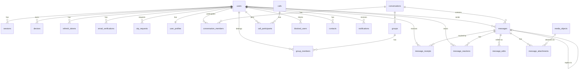

# Database Schema — YBM Connect

| Field             | Value                                      |
|-------------------|--------------------------------------------|
| **Document ID**   | `DOC-DB-002`                               |
| **Version**       | `1.0.0`                                    |
| **Status**        | `APPROVED`                                 |
| **Owner**         | Engineering Lead                           |
| **Last Updated**  | 2026-10-02                                 |
| **Related Docs**  | DOC-DB-001, DOC-DB-003, DOC-DB-004        |
| **Related ADRs**  | ADR-004, ADR-015, ADR-016                  |

---

## ER Diagram

---

## Table Definitions

### `users`

**Purpose:** Core user account table. Stores authentication credentials and account state.

| Column | Type | Nullable | Default | Description |
|--------|------|----------|---------|-------------|
| `id` | `UUID` | NO | `gen_random_uuid()` | Primary key. UUID v4. |
| `email` | `VARCHAR(255)` | NO | — | Unique email address. Lowercased on insert. |
| `password_hash` | `VARCHAR(255)` | NO | — | Argon2id hash. Never stored as plaintext. |
| `display_name` | `VARCHAR(50)` | NO | — | User-chosen display name. |
| `status` | `VARCHAR(20)` | NO | `'PENDING_VERIFICATION'` | Account status: `PENDING_VERIFICATION`, `ACTIVE`, `SUSPENDED`, `DELETED`. |
| `last_seen_at` | `TIMESTAMPTZ` | YES | `NULL` | Last time user was online. Updated on disconnect. |
| `created_at` | `TIMESTAMPTZ` | NO | `NOW()` | Account creation time. |
| `updated_at` | `TIMESTAMPTZ` | NO | `NOW()` | Last account update. |

**Primary Key:** `id`
**Unique Constraints:** `email`
**Check Constraints:** `status IN ('PENDING_VERIFICATION', 'ACTIVE', 'SUSPENDED', 'DELETED')`
**Indexes:**
- `idx_users_email` UNIQUE on `email` — Login lookup, duplicate detection
- `idx_users_status` on `status` — Admin queries for account states

**Expected Cardinality:** 1K-100K users
**Query Patterns:** Lookup by email (login), lookup by ID (profile, auth)
**Security:** `password_hash` must never appear in SELECT * queries outside auth module. Use column-specific SELECTs.

---

### `user_profiles`

**Purpose:** Extended user profile information, separated from auth concerns.

| Column | Type | Nullable | Default | Description |
|--------|------|----------|---------|-------------|
| `user_id` | `UUID` | NO | — | FK → users.id. One-to-one. |
| `avatar_url` | `VARCHAR(500)` | YES | `NULL` | R2 media URL for profile picture. |
| `bio` | `VARCHAR(200)` | YES | `NULL` | Short user bio. |
| `phone_number` | `VARCHAR(20)` | YES | `NULL` | Optional phone number. |
| `created_at` | `TIMESTAMPTZ` | NO | `NOW()` | — |
| `updated_at` | `TIMESTAMPTZ` | NO | `NOW()` | — |

**Primary Key:** `user_id`
**Foreign Keys:** `user_id` → `users(id)` ON DELETE CASCADE
**Query Patterns:** Lookup by user_id (profile view)

---

### `email_verifications`

**Purpose:** Tracks email OTP verification during registration and email changes.

| Column | Type | Nullable | Default | Description |
|--------|------|----------|---------|-------------|
| `id` | `UUID` | NO | `gen_random_uuid()` | Primary key. |
| `user_id` | `UUID` | NO | — | FK → users.id |
| `otp_hash` | `VARCHAR(255)` | NO | — | Hashed OTP (SHA-256 of the 6-digit code). |
| `attempts` | `SMALLINT` | NO | `0` | Failed verification attempts. Max 5. |
| `expires_at` | `TIMESTAMPTZ` | NO | — | OTP expiration (created_at + 10 minutes). |
| `verified_at` | `TIMESTAMPTZ` | YES | `NULL` | When verified. NULL = not yet verified. |
| `created_at` | `TIMESTAMPTZ` | NO | `NOW()` | — |

**Primary Key:** `id`
**Foreign Keys:** `user_id` → `users(id)` ON DELETE CASCADE
**Indexes:**
- `idx_email_verifications_user_id` on `user_id` — Latest verification lookup
- `idx_email_verifications_expires_at` on `expires_at` — Cleanup of expired OTPs
**Check Constraints:** `attempts >= 0 AND attempts <= 5`

---

### `otp_requests`

**Purpose:** Rate-limits OTP requests (password reset, email change).

| Column | Type | Nullable | Default | Description |
|--------|------|----------|---------|-------------|
| `id` | `UUID` | NO | `gen_random_uuid()` | Primary key. |
| `user_id` | `UUID` | NO | — | FK → users.id |
| `otp_type` | `VARCHAR(20)` | NO | — | `PASSWORD_RESET`, `EMAIL_CHANGE` |
| `otp_hash` | `VARCHAR(255)` | NO | — | Hashed OTP. |
| `attempts` | `SMALLINT` | NO | `0` | Failed attempts. |
| `expires_at` | `TIMESTAMPTZ` | NO | — | — |
| `used_at` | `TIMESTAMPTZ` | YES | `NULL` | When consumed. |
| `created_at` | `TIMESTAMPTZ` | NO | `NOW()` | — |

**Primary Key:** `id`
**Foreign Keys:** `user_id` → `users(id)` ON DELETE CASCADE
**Indexes:** `idx_otp_requests_user_type` on `(user_id, otp_type)` — Rate limit check

---

### `sessions`

**Purpose:** Tracks authenticated sessions per device.

| Column | Type | Nullable | Default | Description |
|--------|------|----------|---------|-------------|
| `id` | `UUID` | NO | `gen_random_uuid()` | Primary key. Session ID. |
| `user_id` | `UUID` | NO | — | FK → users.id |
| `device_id` | `UUID` | NO | — | FK → devices.id |
| `ip_address` | `INET` | YES | — | Login IP. |
| `user_agent` | `VARCHAR(500)` | YES | — | Browser/app user agent. |
| `created_at` | `TIMESTAMPTZ` | NO | `NOW()` | Session start. |
| `ended_at` | `TIMESTAMPTZ` | YES | `NULL` | Session end (logout). NULL = active. |
| `expires_at` | `TIMESTAMPTZ` | NO | — | Absolute session expiry. |

**Primary Key:** `id`
**Foreign Keys:** `user_id` → `users(id)` ON DELETE CASCADE, `device_id` → `devices(id)` ON DELETE CASCADE
**Indexes:**
- `idx_sessions_user_id` on `user_id` — List user sessions
- `idx_sessions_active` on `(user_id)` WHERE `ended_at IS NULL` — Active sessions only

---

### `devices`

**Purpose:** Tracks registered devices per user for multi-device support.

| Column | Type | Nullable | Default | Description |
|--------|------|----------|---------|-------------|
| `id` | `UUID` | NO | `gen_random_uuid()` | Primary key. |
| `user_id` | `UUID` | NO | — | FK → users.id |
| `device_name` | `VARCHAR(100)` | YES | — | "Chrome on Windows", "Pixel 7" |
| `device_type` | `VARCHAR(20)` | NO | — | `WEB`, `ANDROID` |
| `push_token` | `VARCHAR(500)` | YES | `NULL` | FCM or Web Push token. |
| `push_provider` | `VARCHAR(20)` | YES | `NULL` | `FCM`, `WEB_PUSH` |
| `last_active_at` | `TIMESTAMPTZ` | YES | — | Last activity on this device. |
| `created_at` | `TIMESTAMPTZ` | NO | `NOW()` | — |

**Primary Key:** `id`
**Foreign Keys:** `user_id` → `users(id)` ON DELETE CASCADE
**Indexes:** `idx_devices_user_id` on `user_id`

---

### `refresh_tokens`

**Purpose:** Stores refresh tokens with rotation tracking for token reuse detection.

| Column | Type | Nullable | Default | Description |
|--------|------|----------|---------|-------------|
| `id` | `UUID` | NO | `gen_random_uuid()` | Primary key. Token ID (included in JWT). |
| `user_id` | `UUID` | NO | — | FK → users.id |
| `session_id` | `UUID` | NO | — | FK → sessions.id |
| `token_hash` | `VARCHAR(255)` | NO | — | SHA-256 hash of the refresh token value. |
| `family_id` | `UUID` | NO | — | Token family ID for rotation tracking. |
| `revoked_at` | `TIMESTAMPTZ` | YES | `NULL` | When revoked. |
| `expires_at` | `TIMESTAMPTZ` | NO | — | 30-day expiry. |
| `created_at` | `TIMESTAMPTZ` | NO | `NOW()` | — |

**Primary Key:** `id`
**Foreign Keys:** `user_id` → `users(id)` ON DELETE CASCADE, `session_id` → `sessions(id)` ON DELETE CASCADE
**Indexes:**
- `idx_refresh_tokens_hash` UNIQUE on `token_hash` — Token lookup
- `idx_refresh_tokens_family` on `family_id` — Reuse detection (revoke all in family)
**Security:** Token values are NEVER stored. Only SHA-256 hashes. If a revoked token from a family is presented, ALL tokens in that family are revoked (reuse detection).

---

### `conversations`

**Purpose:** Represents a communication channel (1-to-1 or group).

| Column | Type | Nullable | Default | Description |
|--------|------|----------|---------|-------------|
| `id` | `UUID` | NO | `gen_random_uuid()` | Primary key. |
| `conversation_type` | `VARCHAR(10)` | NO | — | `DIRECT`, `GROUP` |
| `created_at` | `TIMESTAMPTZ` | NO | `NOW()` | — |
| `updated_at` | `TIMESTAMPTZ` | NO | `NOW()` | Last activity (new message, member change). |

**Primary Key:** `id`
**Check Constraints:** `conversation_type IN ('DIRECT', 'GROUP')`
**Query Patterns:** Lookup by ID, list by user (via conversation_members)

---

### `conversation_members`

**Purpose:** Junction table linking users to conversations.

| Column | Type | Nullable | Default | Description |
|--------|------|----------|---------|-------------|
| `conversation_id` | `UUID` | NO | — | FK → conversations.id |
| `user_id` | `UUID` | NO | — | FK → users.id |
| `joined_at` | `TIMESTAMPTZ` | NO | `NOW()` | — |
| `left_at` | `TIMESTAMPTZ` | YES | `NULL` | NULL = still a member. |
| `last_read_message_id` | `UUID` | YES | `NULL` | FK → messages.id. For unread count. |
| `muted_until` | `TIMESTAMPTZ` | YES | `NULL` | Mute notifications until this time. |

**Primary Key:** `(conversation_id, user_id)`
**Foreign Keys:** `conversation_id` → `conversations(id)`, `user_id` → `users(id)`
**Indexes:**
- `idx_conv_members_user` on `user_id` — "List my conversations"
- `idx_conv_members_conv` on `conversation_id` — "List members of conversation"
**Query Patterns:** "Is user X a member of conversation Y?" — PK lookup. "List all conversations for user X" — index scan on user_id.

---

### `messages`

**Purpose:** Core message storage. Every text or media message.

| Column | Type | Nullable | Default | Description |
|--------|------|----------|---------|-------------|
| `id` | `UUID` | NO | `gen_random_uuid()` | Server-assigned message ID. |
| `client_message_id` | `UUID` | NO | — | Client-generated UUID v7. For idempotency. |
| `conversation_id` | `UUID` | NO | — | FK → conversations.id |
| `sender_id` | `UUID` | NO | — | FK → users.id |
| `content` | `TEXT` | YES | — | Message text. NULL if deleted or media-only. |
| `content_type` | `VARCHAR(20)` | NO | `'text'` | `text`, `image`, `video`, `document`, `voice`, `system` |
| `reply_to_message_id` | `UUID` | YES | `NULL` | FK → messages.id. For replies. |
| `forwarded_from_message_id` | `UUID` | YES | `NULL` | FK → messages.id. For forwards. |
| `edited_at` | `TIMESTAMPTZ` | YES | `NULL` | Last edit time. NULL = never edited. |
| `deleted_at` | `TIMESTAMPTZ` | YES | `NULL` | Soft delete time. NULL = not deleted. |
| `created_at` | `TIMESTAMPTZ` | NO | `NOW()` | Server timestamp. Authoritative for ordering. |

**Primary Key:** `id`
**Unique Constraints:** `(conversation_id, client_message_id)` — Idempotency within a conversation
**Foreign Keys:**
- `conversation_id` → `conversations(id)`
- `sender_id` → `users(id)`
- `reply_to_message_id` → `messages(id)` ON DELETE SET NULL
- `forwarded_from_message_id` → `messages(id)` ON DELETE SET NULL
**Check Constraints:** `content_type IN ('text', 'image', 'video', 'document', 'voice', 'system')`
**Indexes:**
- `idx_messages_conversation_created` on `(conversation_id, created_at DESC)` — Conversation history pagination
- `idx_messages_client_msg_id` UNIQUE on `(conversation_id, client_message_id)` — Idempotency check
- `idx_messages_sender` on `sender_id` — "Messages by user" queries
**Expected Cardinality:** 100K-10M+ messages
**Retention:** Messages are retained indefinitely in V1. Partitioning by month is documented for future implementation.
**Query Patterns:**
- "Last 50 messages in conversation X, before cursor Y" — Index on (conversation_id, created_at DESC)
- "Does client_message_id Z exist in conversation X?" — Unique index for idempotency

---

### `message_receipts`

**Purpose:** Tracks delivery and read status per message per user.

| Column | Type | Nullable | Default | Description |
|--------|------|----------|---------|-------------|
| `message_id` | `UUID` | NO | — | FK → messages.id |
| `user_id` | `UUID` | NO | — | FK → users.id (recipient) |
| `delivered_at` | `TIMESTAMPTZ` | YES | `NULL` | When delivered to device. |
| `read_at` | `TIMESTAMPTZ` | YES | `NULL` | When user read the message. |

**Primary Key:** `(message_id, user_id)`
**Foreign Keys:** `message_id` → `messages(id)`, `user_id` → `users(id)`
**Indexes:** `idx_receipts_user_message` on `(user_id, message_id)` — "Has user read this?"
**Query Patterns:** Aggregate — "How many recipients have read message X?"

---

### `message_reactions`

**Purpose:** Emoji reactions on messages.

| Column | Type | Nullable | Default | Description |
|--------|------|----------|---------|-------------|
| `message_id` | `UUID` | NO | — | FK → messages.id |
| `user_id` | `UUID` | NO | — | FK → users.id |
| `emoji` | `VARCHAR(20)` | NO | — | Emoji character or shortcode. |
| `created_at` | `TIMESTAMPTZ` | NO | `NOW()` | — |

**Primary Key:** `(message_id, user_id, emoji)`
**Foreign Keys:** `message_id` → `messages(id)`, `user_id` → `users(id)`

---

### `message_edits`

**Purpose:** Edit history for messages.

| Column | Type | Nullable | Default | Description |
|--------|------|----------|---------|-------------|
| `id` | `UUID` | NO | `gen_random_uuid()` | Primary key. |
| `message_id` | `UUID` | NO | — | FK → messages.id |
| `old_content` | `TEXT` | NO | — | Content before this edit. |
| `edited_at` | `TIMESTAMPTZ` | NO | `NOW()` | When this edit occurred. |

**Primary Key:** `id`
**Foreign Keys:** `message_id` → `messages(id)` ON DELETE CASCADE
**Indexes:** `idx_message_edits_message` on `message_id`

---

### `message_attachments`

**Purpose:** Links messages to media objects.

| Column | Type | Nullable | Default | Description |
|--------|------|----------|---------|-------------|
| `id` | `UUID` | NO | `gen_random_uuid()` | Primary key. |
| `message_id` | `UUID` | NO | — | FK → messages.id |
| `media_id` | `UUID` | NO | — | FK → media_objects.id |
| `position` | `SMALLINT` | NO | `0` | Order when message has multiple attachments. |

**Primary Key:** `id`
**Foreign Keys:** `message_id` → `messages(id)` ON DELETE CASCADE, `media_id` → `media_objects(id)`
**Indexes:** `idx_attachments_message` on `message_id`

---

### `media_objects`

**Purpose:** Metadata for uploaded media files stored in R2.

| Column | Type | Nullable | Default | Description |
|--------|------|----------|---------|-------------|
| `id` | `UUID` | NO | `gen_random_uuid()` | Primary key. |
| `uploader_id` | `UUID` | NO | — | FK → users.id |
| `file_name` | `VARCHAR(255)` | NO | — | Original filename. |
| `file_size` | `BIGINT` | NO | — | Size in bytes. |
| `mime_type` | `VARCHAR(100)` | NO | — | Validated MIME type. |
| `media_type` | `VARCHAR(20)` | NO | — | `image`, `video`, `document`, `voice` |
| `r2_key` | `VARCHAR(500)` | NO | — | R2 object key. |
| `thumbnail_r2_key` | `VARCHAR(500)` | YES | `NULL` | R2 key for thumbnail (images, videos). |
| `width` | `INTEGER` | YES | `NULL` | Image/video width in pixels. |
| `height` | `INTEGER` | YES | `NULL` | Image/video height in pixels. |
| `duration_seconds` | `REAL` | YES | `NULL` | Video/voice duration. |
| `checksum_sha256` | `VARCHAR(64)` | NO | — | SHA-256 of file content. |
| `created_at` | `TIMESTAMPTZ` | NO | `NOW()` | — |

**Primary Key:** `id`
**Foreign Keys:** `uploader_id` → `users(id)`
**Unique Constraints:** `r2_key`
**Indexes:** `idx_media_uploader` on `uploader_id`
**Security:** The `r2_key` is internal. Clients never see it directly; they receive signed URLs.

---

### `groups`

**Purpose:** Group metadata (name, description). Linked to a conversation.

| Column | Type | Nullable | Default | Description |
|--------|------|----------|---------|-------------|
| `id` | `UUID` | NO | `gen_random_uuid()` | Primary key. |
| `conversation_id` | `UUID` | NO | — | FK → conversations.id. One-to-one. |
| `name` | `VARCHAR(100)` | NO | — | Group name. |
| `description` | `VARCHAR(500)` | YES | `NULL` | Group description. |
| `avatar_url` | `VARCHAR(500)` | YES | `NULL` | Group avatar media URL. |
| `created_by` | `UUID` | NO | — | FK → users.id (creator). |
| `created_at` | `TIMESTAMPTZ` | NO | `NOW()` | — |
| `updated_at` | `TIMESTAMPTZ` | NO | `NOW()` | — |

**Primary Key:** `id`
**Foreign Keys:** `conversation_id` → `conversations(id)`, `created_by` → `users(id)`
**Unique Constraints:** `conversation_id`

---

### `group_members`

**Purpose:** Group membership with roles.

| Column | Type | Nullable | Default | Description |
|--------|------|----------|---------|-------------|
| `group_id` | `UUID` | NO | — | FK → groups.id |
| `user_id` | `UUID` | NO | — | FK → users.id |
| `role` | `VARCHAR(10)` | NO | `'MEMBER'` | `ADMIN`, `MEMBER` |
| `joined_at` | `TIMESTAMPTZ` | NO | `NOW()` | — |

**Primary Key:** `(group_id, user_id)`
**Foreign Keys:** `group_id` → `groups(id)` ON DELETE CASCADE, `user_id` → `users(id)`
**Check Constraints:** `role IN ('ADMIN', 'MEMBER')`

---

### `calls`

**Purpose:** Call records (audio and video).

| Column | Type | Nullable | Default | Description |
|--------|------|----------|---------|-------------|
| `id` | `UUID` | NO | `gen_random_uuid()` | Primary key. |
| `conversation_id` | `UUID` | NO | — | FK → conversations.id |
| `initiated_by` | `UUID` | NO | — | FK → users.id (caller) |
| `call_type` | `VARCHAR(10)` | NO | — | `AUDIO`, `VIDEO` |
| `status` | `VARCHAR(15)` | NO | `'CALLING'` | `CALLING`, `RINGING`, `CONNECTING`, `CONNECTED`, `ENDED`, `REJECTED`, `MISSED`, `FAILED` |
| `started_at` | `TIMESTAMPTZ` | YES | `NULL` | When call connected. |
| `ended_at` | `TIMESTAMPTZ` | YES | `NULL` | When call ended. |
| `duration_seconds` | `INTEGER` | YES | `NULL` | Calculated from started_at to ended_at. |
| `end_reason` | `VARCHAR(30)` | YES | `NULL` | `NORMAL`, `REJECTED`, `TIMEOUT`, `ICE_FAILED`, `ERROR` |
| `created_at` | `TIMESTAMPTZ` | NO | `NOW()` | When call was initiated. |

**Primary Key:** `id`
**Foreign Keys:** `conversation_id` → `conversations(id)`, `initiated_by` → `users(id)`
**Indexes:** `idx_calls_conversation` on `conversation_id` — Call history per conversation
**Check Constraints:** `call_type IN ('AUDIO', 'VIDEO')`, `status IN (...)` 

---

### `call_participants`

**Purpose:** Tracks who participated in a call and their join/leave times.

| Column | Type | Nullable | Default | Description |
|--------|------|----------|---------|-------------|
| `call_id` | `UUID` | NO | — | FK → calls.id |
| `user_id` | `UUID` | NO | — | FK → users.id |
| `joined_at` | `TIMESTAMPTZ` | YES | `NULL` | When participant joined. |
| `left_at` | `TIMESTAMPTZ` | YES | `NULL` | When participant left. |

**Primary Key:** `(call_id, user_id)`
**Foreign Keys:** `call_id` → `calls(id)` ON DELETE CASCADE, `user_id` → `users(id)`

---

### `notifications`

**Purpose:** Notification records for audit/history.

| Column | Type | Nullable | Default | Description |
|--------|------|----------|---------|-------------|
| `id` | `UUID` | NO | `gen_random_uuid()` | Primary key. |
| `user_id` | `UUID` | NO | — | FK → users.id |
| `notification_type` | `VARCHAR(30)` | NO | — | `NEW_MESSAGE`, `INCOMING_CALL`, `MISSED_CALL`, `GROUP_INVITE` |
| `title` | `VARCHAR(200)` | NO | — | Notification title. |
| `body` | `VARCHAR(500)` | YES | — | Notification body. |
| `data` | `JSONB` | YES | `NULL` | Structured payload (conversation_id, message_id, etc.). |
| `sent_at` | `TIMESTAMPTZ` | YES | `NULL` | When push was sent. |
| `read_at` | `TIMESTAMPTZ` | YES | `NULL` | When user acknowledged. |
| `created_at` | `TIMESTAMPTZ` | NO | `NOW()` | — |

**Primary Key:** `id`
**Foreign Keys:** `user_id` → `users(id)` ON DELETE CASCADE
**Indexes:** `idx_notifications_user_created` on `(user_id, created_at DESC)`

---

### `blocked_users`

**Purpose:** User-to-user blocking.

| Column | Type | Nullable | Default | Description |
|--------|------|----------|---------|-------------|
| `blocker_id` | `UUID` | NO | — | FK → users.id (who blocked) |
| `blocked_id` | `UUID` | NO | — | FK → users.id (who is blocked) |
| `created_at` | `TIMESTAMPTZ` | NO | `NOW()` | — |

**Primary Key:** `(blocker_id, blocked_id)`
**Foreign Keys:** Both → `users(id)`
**Check Constraints:** `blocker_id != blocked_id`

---

### `contacts`

**Purpose:** User's contact list (not phone contacts — platform contacts).

| Column | Type | Nullable | Default | Description |
|--------|------|----------|---------|-------------|
| `user_id` | `UUID` | NO | — | FK → users.id |
| `contact_user_id` | `UUID` | NO | — | FK → users.id |
| `nickname` | `VARCHAR(50)` | YES | `NULL` | Optional custom name. |
| `created_at` | `TIMESTAMPTZ` | NO | `NOW()` | — |

**Primary Key:** `(user_id, contact_user_id)`
**Foreign Keys:** Both → `users(id)`
**Check Constraints:** `user_id != contact_user_id`

---

### `audit_logs`

**Purpose:** Security-relevant event log. Immutable (append-only).

| Column | Type | Nullable | Default | Description |
|--------|------|----------|---------|-------------|
| `id` | `BIGSERIAL` | NO | auto | Primary key. Sequential for ordering. |
| `user_id` | `UUID` | YES | `NULL` | Actor (NULL for system events). |
| `action` | `VARCHAR(50)` | NO | — | `LOGIN`, `LOGOUT`, `PASSWORD_CHANGE`, `SESSION_REVOKE`, `GROUP_CREATE`, etc. |
| `resource_type` | `VARCHAR(30)` | YES | — | `USER`, `SESSION`, `MESSAGE`, `GROUP` |
| `resource_id` | `UUID` | YES | `NULL` | ID of the affected resource. |
| `ip_address` | `INET` | YES | — | — |
| `details` | `JSONB` | YES | `NULL` | Additional context. |
| `created_at` | `TIMESTAMPTZ` | NO | `NOW()` | — |

**Primary Key:** `id`
**Indexes:**
- `idx_audit_user` on `user_id` — "What did user X do?"
- `idx_audit_action` on `action` — "All login events"
- `idx_audit_created` on `created_at` — Time-range queries
**Security:** This table should NOT have UPDATE or DELETE permissions for the application role. Append-only.
**Retention:** 90 days in V1. Archive to cold storage after 90 days.

---

## Indexing Strategy

### Principles
1. Every foreign key has an index (PostgreSQL does NOT auto-create FK indexes).
2. Every column used in WHERE clauses of frequent queries has an index.
3. Composite indexes are ordered by selectivity (most selective first) for equality checks, or by the access pattern (e.g., conversation_id first, then created_at for pagination).
4. Partial indexes are used where queries filter on a specific condition (e.g., active sessions only).

### Hot Query Index Map

| Query Pattern | Table | Index | Type |
|---|---|---|---|
| Login by email | users | `idx_users_email` | B-tree, UNIQUE |
| Conversation history (paginated) | messages | `idx_messages_conversation_created` | B-tree composite |
| Idempotency check | messages | `idx_messages_client_msg_id` | B-tree, UNIQUE |
| Active sessions for user | sessions | `idx_sessions_active` | Partial (WHERE ended_at IS NULL) |
| Refresh token lookup | refresh_tokens | `idx_refresh_tokens_hash` | B-tree, UNIQUE |
| User's conversations | conversation_members | `idx_conv_members_user` | B-tree |
| Conversation members | conversation_members | `idx_conv_members_conv` | B-tree |

## Transaction Boundaries

| Operation | Transaction Scope | Isolation Level | Notes |
|---|---|---|---|
| Send message | INSERT message + publish event | READ COMMITTED | ACK only after commit |
| Register user | INSERT user + INSERT email_verification | READ COMMITTED | Atomic user creation |
| Create group | INSERT group + INSERT members + INSERT conversation + INSERT conv_members | READ COMMITTED | All-or-nothing |
| Refresh token rotation | Revoke old token + Insert new token | SERIALIZABLE | Prevents race conditions |
| Delete message | UPDATE message (soft delete) | READ COMMITTED | Single row update |

## Race Conditions

| Scenario | Risk | Mitigation |
|---|---|---|
| Two clients send same client_message_id | Duplicate message | UNIQUE constraint on (conversation_id, client_message_id); INSERT ... ON CONFLICT DO NOTHING |
| Two refresh attempts with same token | Token reuse attack | SERIALIZABLE isolation on token rotation; reuse detection via family_id |
| Concurrent group member add/remove | Inconsistent membership | Row-level locks on group_members within transaction |
| Concurrent message edit | Lost update | Optimistic locking via edited_at timestamp check |

---

*Next: [tables.md](tables.md) · [indexes.md](indexes.md) · [migrations.md](migrations.md)*
