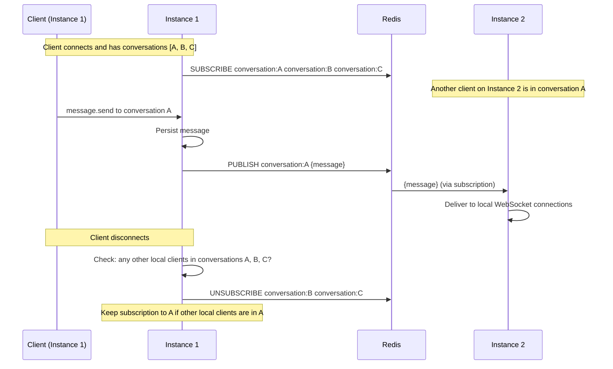
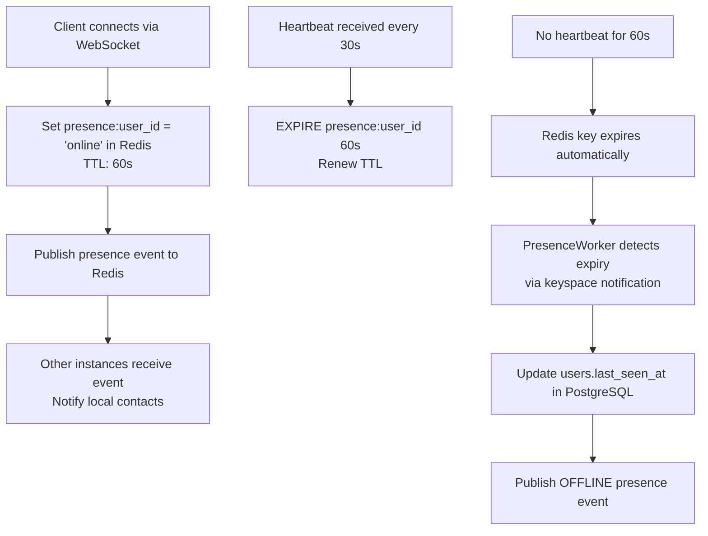

# Redis Architecture — YBM Connect

| Field             | Value                                      |
|-------------------|--------------------------------------------|
| **Document ID**   | `DOC-REDIS-001`                            |
| **Version**       | `1.0.0`                                    |
| **Status**        | `APPROVED`                                 |
| **Owner**         | Engineering Lead                           |
| **Last Updated**  | 2026-10-02                                 |
| **Related Docs**  | DOC-ARCH-001, DOC-MSG-001, DOC-REDIS-002-007 |
| **Related ADRs**  | ADR-005                                    |

---

## 1. What Redis Stores (and Doesn't)

### Redis IS used for:

| Purpose | Key Pattern | Value | TTL | Why Redis? |
|---------|-------------|-------|-----|-----------|
| **Access token → session lookup** | `session:{token_hash}` | JSON: `{user_id, session_id, device_id}` | 15 min | Sub-ms auth check on every request |
| **Online presence** | `presence:{user_id}` | `"online"` | 60s (renewed on heartbeat) | Ephemeral state, high read frequency |
| **Typing indicators** | `typing:{conversation_id}:{user_id}` | `"1"` | 5s | Ultra-short-lived, high frequency |
| **Cross-instance message routing** | Pub/Sub channel: `conversation:{id}` | Message event JSON | N/A (pub/sub) | Real-time fan-out across instances |
| **Cross-instance presence events** | Pub/Sub channel: `presence` | Presence event JSON | N/A (pub/sub) | Broadcast presence changes |
| **Rate limiting counters** | `ratelimit:{scope}:{key}` | Counter | Window duration | Fast increment, auto-expire |
| **Active call tracking** | `call:{user_id}` | `{call_id}` | 1h (max call duration) | Quick "is user in a call?" check |
| **WebSocket connection registry** | `connections:{user_id}` | Set of `{instance_id}:{device_id}` | 5 min (renewed) | Route messages to correct instance |

### Redis is NOT used for:

| Data | Where it lives | Why not Redis? |
|------|----------------|----------------|
| Messages | PostgreSQL | Must survive Redis restart. Durability required. |
| User accounts | PostgreSQL | Relational data with constraints. |
| Sessions (source of truth) | PostgreSQL | Redis has session cache; PostgreSQL is authoritative. |
| Media files | Cloudflare R2 | Binary objects, too large for Redis. |
| Message receipts | PostgreSQL | Need historical query capability. |
| Audit logs | PostgreSQL | Append-only, relational queries. |

**Key principle:** Redis loss = degraded real-time features. PostgreSQL loss = system cannot function. Redis is a cache and coordination layer, NOT a data store.

## 2. Pub/Sub Architecture

### Conversation Channel

When a message is sent to a conversation, the backend publishes to a Redis channel named `conversation:{conversation_id}`:

```
Publisher (Instance 1):
  PUBLISH conversation:abc123 '{"type":"message.new","message":{...}}'

Subscriber (Instance 2):
  SUBSCRIBE conversation:abc123
  → Receives the event → Delivers to local WebSocket connections
```

### Subscription Management

Each backend instance subscribes to Redis channels for conversations that have **at least one connected member** on that instance.



### Single-Instance Optimization

When sender and recipient are on the **same** instance, the message is delivered via in-process channels WITHOUT going through Redis. Redis pub/sub is only used for cross-instance routing.

## 3. Presence Management



### Redis Keyspace Notifications

We use Redis keyspace notifications to detect presence key expiry:

```
CONFIG SET notify-keyspace-events Ex
SUBSCRIBE __keyevent@0__:expired
```

When a `presence:{user_id}` key expires (user didn't renew heartbeat), the PresenceWorker:
1. Receives the expiry notification
2. Updates `users.last_seen_at` in PostgreSQL
3. Publishes an OFFLINE presence event to subscribed instances

## 4. Rate Limiting Implementation

Using the **sliding window counter** algorithm in Redis:

```lua
-- KEYS[1] = rate limit key (e.g., "ratelimit:message_send:user123")
-- ARGV[1] = window size in seconds
-- ARGV[2] = max requests
-- ARGV[3] = current timestamp

local key = KEYS[1]
local window = tonumber(ARGV[1])
local max_requests = tonumber(ARGV[2])
local now = tonumber(ARGV[3])

-- Remove entries outside the window
redis.call('ZREMRANGEBYSCORE', key, 0, now - window)

-- Count current requests in window
local count = redis.call('ZCARD', key)

if count < max_requests then
    -- Allow request, add timestamp
    redis.call('ZADD', key, now, now .. ':' .. math.random())
    redis.call('EXPIRE', key, window)
    return {1, max_requests - count - 1}  -- allowed, remaining
else
    return {0, 0}  -- denied, 0 remaining
end
```

## 5. Connection Registry

Each backend instance registers its WebSocket connections in Redis so other instances can route messages:

```
# When client connects:
SADD connections:user123 "instance1:device_abc"
EXPIRE connections:user123 300  # 5 min, renewed by heartbeat

# When routing a message to user123:
SMEMBERS connections:user123
# → ["instance1:device_abc", "instance2:device_def"]
# Publish to instance1 and instance2
```

## 6. Failure Behavior

### What happens when Redis goes down?

| Feature | Impact | Mitigation |
|---------|--------|------------|
| **Session lookup** | Falls back to PostgreSQL (slower but works) | DB-backed session verification |
| **Message routing** | Real-time delivery stops; messages still persist in PostgreSQL | Clients receive messages on sync/reconnect |
| **Presence** | Shows stale data; no updates | Presence is cosmetic, not critical |
| **Typing indicators** | Stop working entirely | Acceptable degradation |
| **Rate limiting** | Falls back to in-memory rate limiting (per-instance, less accurate) | Approximate rate limiting is better than none |
| **Call tracking** | Cannot check "is user in a call?" | Allow calls (risk: user gets two simultaneous calls) |

### Recovery after Redis restart:

1. Connection pool reconnects automatically (with retry backoff)
2. Presence keys are re-set by connected clients on next heartbeat
3. Subscriptions are re-established by the pub/sub listener
4. Rate limit counters reset (briefly allows burst, then normalizes)
5. Session cache rebuilds on-demand (each request re-caches from PostgreSQL)

## 7. Expiration Strategy

| Key Pattern | TTL | Reason |
|-------------|-----|--------|
| `session:{hash}` | 15 min (matches access token) | Auto-cleanup expired sessions |
| `presence:{user_id}` | 60s (renewed every 30s) | Detect offline users |
| `typing:{conv}:{user}` | 5s | Auto-stop typing indicator |
| `ratelimit:*` | Window duration (60s-3600s) | Auto-reset rate limits |
| `call:{user_id}` | 1h | Max call duration |
| `connections:{user_id}` | 5 min (renewed by heartbeat) | Cleanup stale connections |

**Principle:** Every Redis key MUST have a TTL. No key should exist indefinitely. This prevents unbounded memory growth.

---

*Next: [cache-strategy.md](cache-strategy.md) · [pubsub.md](pubsub.md)*
