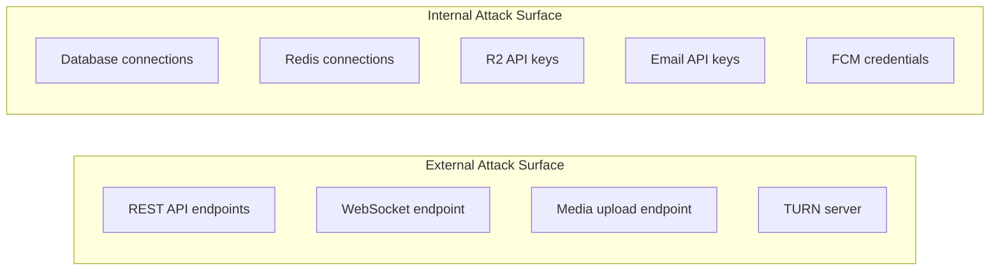
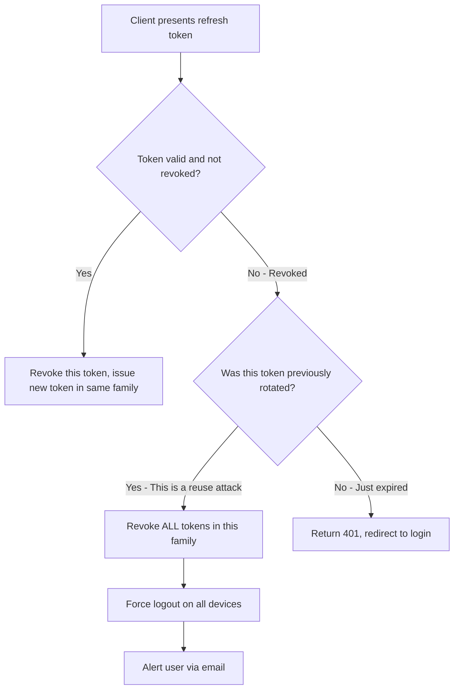

# Security Architecture — YBM Connect

| Field             | Value                                      |
|-------------------|--------------------------------------------|
| **Document ID**   | `DOC-SEC-001`                              |
| **Version**       | `1.0.0`                                    |
| **Status**        | `APPROVED`                                 |
| **Owner**         | Engineering Lead                           |
| **Last Updated**  | 2026-10-02                                 |
| **Related Docs**  | DOC-SEC-002 through 014, DOC-AUTH-001      |
| **Related ADRs**  | ADR-014                                    |

---

## 1. Security Principles

1. **Defense in depth:** Multiple layers of security controls. No single control is the sole defense.
2. **Least privilege:** Every component has only the permissions it needs.
3. **Secure by default:** New features ship with security controls. Security is opt-out, not opt-in.
4. **No security through obscurity:** Security relies on cryptographic primitives and access controls, not hidden URLs or undocumented APIs.
5. **Fail secure:** On error, deny access rather than grant it.

## 2. Threat Model

### 2.1 Attack Surface



### 2.2 Threat Catalog

| ID | Threat | Attack | Impact | Likelihood | Prevention | Detection | Mitigation |
|---|---|---|---|---|---|---|---|
| **T-001** | Brute force login | Automated password guessing against `/api/v1/auth/login` | Account compromise | HIGH | Rate limiting (10 attempts / 15 min per email), Argon2id (slow hashing), account lockout after 10 failures | Monitor failed login rate per IP and per account | Temporary lockout (30 min), email notification to user |
| **T-002** | Credential stuffing | Using leaked credentials from other breaches | Account compromise | MEDIUM | Rate limiting per IP, breached password check (future), MFA (future) | Anomalous login patterns (new IP, new device) | Force password reset on suspicious activity |
| **T-003** | OTP abuse | Brute-forcing 6-digit OTP (1M combinations) | Account takeover | MEDIUM | Max 5 attempts per OTP, 10-minute expiry, rate limit OTP requests (3/hr), OTP is hashed (not stored plaintext) | Monitor OTP failure rate | OTP invalidated after 5 failures |
| **T-004** | Session theft | Stealing access/refresh tokens via XSS, network sniffing, or device compromise | Full account access | MEDIUM | HTTPS only, HttpOnly cookies (web), secure storage (mobile), short token lifetime (15 min), refresh rotation | Token reuse detection (rotated token reused = compromise) | Revoke all sessions on reuse detection |
| **T-005** | WebSocket hijacking | Intercepting or injecting WebSocket messages | Message tampering, impersonation | LOW | WSS (TLS), token auth on connect, per-message validation | Invalid message format detection | Connection termination |
| **T-006** | CSRF | Tricking user's browser into making authenticated requests | Unauthorized actions | MEDIUM | SameSite=Strict cookies, CSRF token for state-changing REST endpoints, WebSocket auth via token (not cookie) | Unexpected request patterns | Block request |
| **T-007** | XSS | Injecting malicious JavaScript via message content or profile fields | Session theft, UI manipulation | MEDIUM | Server-side input sanitization, Content-Security-Policy headers, React's default escaping, never use `dangerouslySetInnerHTML` | CSP violation reports | Sanitize stored content, patch |
| **T-008** | SQL injection | Malicious SQL in user input | Data breach, data destruction | LOW | Parameterized queries (sqlx), no string concatenation for SQL, input validation | SQL error pattern monitoring | Parameterized queries eliminate this class |
| **T-009** | SSRF | Tricking server into making requests to internal services | Internal network access | LOW | No user-controlled URLs in server-side requests (media URLs are generated, not user-provided), allowlist for outbound requests | Monitor outbound request patterns | Block unexpected outbound requests |
| **T-010** | File upload attacks | Uploading malicious files (web shells, malware, oversized files, zip bombs) | Server compromise, storage abuse, serving malware | MEDIUM | Magic byte validation (not just extension), file size limits, content-type verification, store in R2 (not on server filesystem), generate new filenames (no path traversal) | Monitor upload sizes and types | Reject invalid files, quarantine suspicious files |
| **T-011** | MIME spoofing | Renaming `.exe` to `.jpg` to bypass filters | Serving executable content | MEDIUM | Validate magic bytes (first N bytes of file), set `Content-Disposition: attachment` for downloads, explicit `Content-Type` header on serve | Type mismatch logging | Reject files where extension doesn't match magic bytes |
| **T-012** | Replay attacks | Re-sending captured WebSocket messages | Duplicate actions, state manipulation | LOW | `request_id` uniqueness, `client_message_id` idempotency, timestamp validation (reject messages > 5 min old) | Duplicate request_id detection | Idempotency ensures no effect on replay |
| **T-013** | Authorization bypass (IDOR) | Accessing resources by guessing UUIDs | Reading other users' messages, modifying other users' data | MEDIUM | Every endpoint checks that the authenticated user is authorized to access the requested resource. UUIDs are not sequential (UUID v4 for most IDs). | Authorization failure logging | Return 403, log the attempt |
| **T-014** | Rate limit bypass | Using multiple IPs, distributed attacks | Service degradation | MEDIUM | Per-user rate limits (not just per-IP), Cloudflare WAF rate limiting at edge, application-level rate limiting | Spike detection in request rate | Escalating blocks (longer cooldown) |
| **T-015** | Account enumeration | Testing if emails exist via registration or login error messages | Privacy breach, targeted attacks | MEDIUM | Registration: return same response for existing and new emails. Login: generic "Invalid credentials" message. Password reset: always returns success. | Monitor registration/reset patterns | Consistent error messages |
| **T-016** | DDoS | Overwhelming the server with traffic | Service unavailability | MEDIUM | Cloudflare DDoS protection, connection limits, WebSocket connection rate limiting | Cloudflare alerts, traffic monitoring | Cloudflare mitigation, scale up |
| **T-017** | Secret leakage | Credentials in logs, environment variables exposed, secrets in code | Full system compromise | MEDIUM | Never log secrets, use `.env` files (not committed), structured logging filters, secret scanning in CI | Secret scanning tools, log monitoring | Rotate all exposed secrets immediately |
| **T-018** | Sensitive data in logs | Logging passwords, tokens, OTPs, message content | Privacy breach, compliance violation | MEDIUM | Structured logging with explicit field allowlists, never log request bodies containing auth fields, redact sensitive fields | Log audit | Purge offending logs, fix logging code |

## 3. Authentication Security

### Password Hashing: Argon2id

```
Algorithm: Argon2id
Memory:   64 MB (65536 KiB)
Time:     3 iterations
Threads:  4 parallelism lanes
Salt:     16 bytes (cryptographically random)
Hash:     32 bytes output
```

**Why Argon2id?** It's the OWASP-recommended password hashing algorithm. It's memory-hard (resists GPU attacks) and provides side-channel resistance (resists timing attacks).

**Tuning:** These parameters should produce ~0.5-1 second hash time on the deployment hardware. Adjust if too fast (vulnerable to brute force) or too slow (bad login UX).

### Token Architecture

```
Access Token:
  Format:   Opaque (random 32 bytes, base64url encoded)
  Lifetime: 15 minutes
  Storage:  Redis (server-side session lookup)
  Sent via: Authorization: Bearer header (REST), query param (WebSocket)

Refresh Token:
  Format:   Opaque (random 64 bytes, base64url encoded)
  Lifetime: 30 days
  Storage:  PostgreSQL (token_hash), HttpOnly cookie (web), secure storage (mobile)
  Rotation: On every use (old token revoked, new token issued)
  Family:   Tracked via family_id for reuse detection

NOT using JWT for access tokens because:
  - JWTs cannot be revoked before expiry without server-side state
  - If we need server-side state anyway, opaque tokens are simpler
  - JWTs are larger (header + payload + signature vs. 32 bytes)
  - JWT parsing is unnecessary computation for every request
```

### Token Reuse Detection



## 4. Rate Limiting Strategy

### Multi-Layer Rate Limiting

```
Layer 1: Cloudflare Edge
  - IP-based rate limiting (DDoS protection)
  - 1000 requests/minute per IP (configurable)

Layer 2: Application Rate Limiting (Axum middleware)
  - Per-user rate limits (by user_id from auth token)
  - Per-endpoint rate limits (different limits for different operations)
  - Per-IP rate limits for unauthenticated endpoints

Layer 3: Business Logic Rate Limits
  - OTP requests: 3 per hour per email
  - Login attempts: 10 per 15 minutes per email
  - Registration: 5 per hour per IP
  - Messages: 30 per minute per user
```

### Rate Limit Response

```json
HTTP 429 Too Many Requests
Retry-After: 60
X-RateLimit-Limit: 30
X-RateLimit-Remaining: 0
X-RateLimit-Reset: 1696248000

{
  "success": false,
  "error": {
    "code": "RATE_LIMITED",
    "message": "Too many requests. Try again in 60 seconds.",
    "details": {
      "retry_after_seconds": 60
    }
  }
}
```

## 5. Input Validation

| Input | Validation | Sanitization |
|-------|-----------|--------------|
| Email | RFC 5322 format, max 255 chars, lowercase | Trim whitespace, lowercase |
| Password | 8-128 chars, >= 1 uppercase, >= 1 lowercase, >= 1 digit | None (hash as-is) |
| Display name | 2-50 chars, printable characters only | Trim whitespace, strip control characters |
| Message content | 1-4096 UTF-8 chars | Strip null bytes, normalize Unicode |
| File upload | Magic byte validation, size limits, type allowlist | Generate new filename, strip EXIF metadata (images) |
| UUID parameters | Valid UUID format | Reject invalid |

## 6. Security Headers

```
Strict-Transport-Security: max-age=63072000; includeSubDomains; preload
Content-Security-Policy: default-src 'self'; script-src 'self'; style-src 'self' 'unsafe-inline'; img-src 'self' https://*.r2.cloudflarestorage.com; connect-src 'self' wss://*.ybmconnect.com
X-Content-Type-Options: nosniff
X-Frame-Options: DENY
X-XSS-Protection: 0
Referrer-Policy: strict-origin-when-cross-origin
Permissions-Policy: camera=self, microphone=self, geolocation=()
```

## 7. Secrets Management

| Secret | Storage | Rotation |
|--------|---------|----------|
| Database password | Environment variable | Every 90 days |
| Redis password | Environment variable | Every 90 days |
| R2 access key | Environment variable | Every 90 days |
| Email API key | Environment variable | Every 90 days |
| FCM credentials | Environment variable (JSON file path) | Per Google's recommendation |
| VAPID keys | Environment variable | Annually (or if compromised) |
| TURN secret | Environment variable | Every 90 days |
| Token signing key | Environment variable | Every 30 days (with grace period for old key) |

**Rules:**
- NEVER commit secrets to Git
- NEVER log secrets
- NEVER include secrets in error messages
- Use `.env.example` with placeholder values in the repository
- Use `.env` (gitignored) for local development
- Use managed secret stores (e.g., Cloudflare Secrets, cloud vault) for production

## 8. Security Checklist

- [ ] All passwords hashed with Argon2id
- [ ] All API endpoints require authentication (except public endpoints)
- [ ] All authenticated endpoints check authorization
- [ ] HTTPS everywhere (no HTTP)
- [ ] Security headers set on all responses
- [ ] CSRF protection on state-changing endpoints
- [ ] Input validated on all endpoints
- [ ] File uploads validated by magic bytes
- [ ] Rate limiting on all public endpoints
- [ ] No secrets in logs
- [ ] No secrets in Git
- [ ] SQL injection prevention (parameterized queries)
- [ ] XSS prevention (Content-Security-Policy, React escaping)
- [ ] CORS restricted to known origins
- [ ] Refresh token rotation with reuse detection
- [ ] Account lockout on failed login attempts
- [ ] Audit logging for security events
- [ ] Regular dependency vulnerability scanning

---

*Next: [threat-model.md](threat-model.md) · [rate-limiting.md](rate-limiting.md)*
