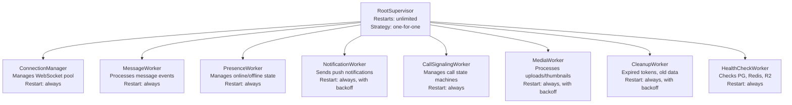
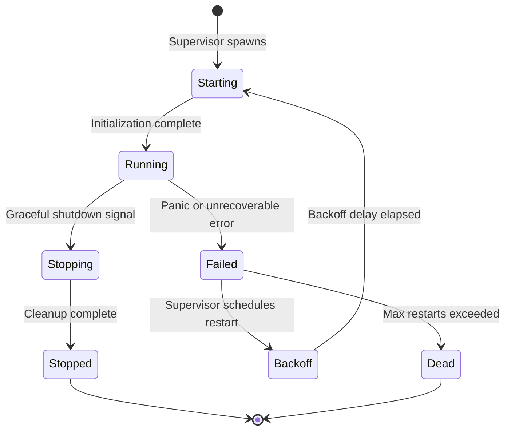
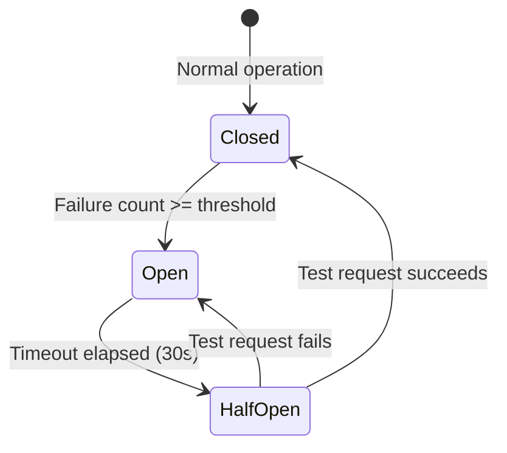
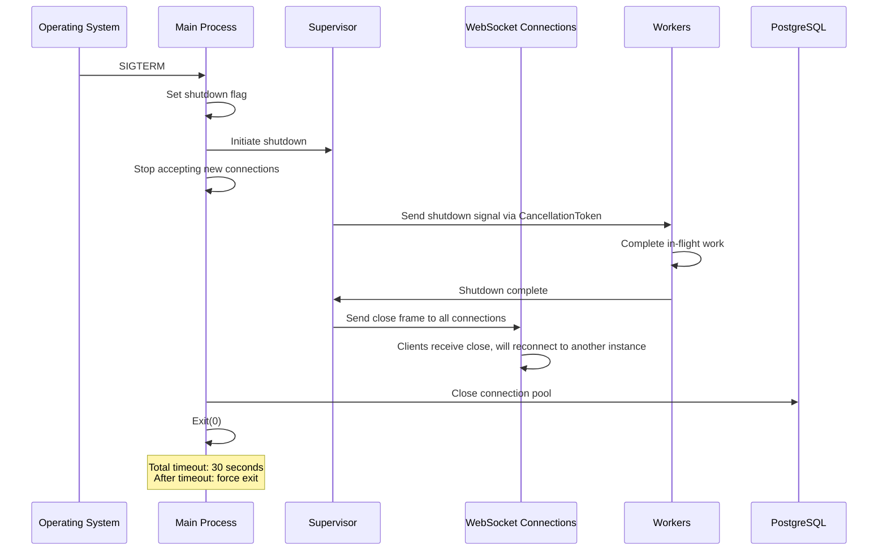

# Fault Tolerance — YBM Connect

| Field             | Value                                      |
|-------------------|--------------------------------------------|
| **Document ID**   | `DOC-FT-001`                               |
| **Version**       | `1.0.0`                                    |
| **Status**        | `APPROVED`                                 |
| **Owner**         | Engineering Lead                           |
| **Last Updated**  | 2026-10-02                                 |
| **Related Docs**  | DOC-ARCH-009, DOC-FT-002 through 009      |
| **Related ADRs**  | ADR-012                                    |

---

## 1. Supervision Tree



### Worker Specifications

| Worker | Inputs | Outputs | Dependencies | Failure Conditions | Restart Strategy | Max Restarts | Backoff |
|--------|--------|---------|-------------|-------------------|------------------|-------------|---------|
| **ConnectionManager** | WebSocket upgrade requests | Managed connections map | Tokio, TLS | OOM, file descriptor exhaustion | Immediate restart | 10/minute | 1s, 2s, 4s, 8s, 16s, 30s max |
| **MessageWorker** | Messages from WebSocket handlers via mpsc channel | Persisted messages, Redis pub/sub events | PostgreSQL, Redis | DB unavailable, Redis unavailable | Immediate restart | 10/minute | 1s, 2s, 4s, 8s |
| **PresenceWorker** | Connect/disconnect events, heartbeats | Redis presence keys, presence broadcasts | Redis | Redis unavailable | Restart with 2s delay | 5/minute | 2s, 4s, 8s, 16s |
| **NotificationWorker** | Notification events from message/call workers | Push notifications to FCM/Web Push | FCM API, Web Push API | External service unavailable | Restart with backoff | 5/minute | 5s, 10s, 20s, 60s |
| **CallSignalingWorker** | Call offer/answer/ICE events | Relayed signaling messages | WebSocket connections | Connection closed during call | Immediate restart | 10/minute | 1s |
| **MediaWorker** | Upload requests | Processed media in R2 | R2 API, image processing | R2 unavailable, processing error | Restart with backoff | 5/minute | 5s, 10s, 30s |
| **CleanupWorker** | Timer tick (every 5 minutes) | Deleted expired records | PostgreSQL | DB unavailable | Restart with long backoff | 3/minute | 30s, 60s, 120s |
| **HealthCheckWorker** | Timer tick (every 15 seconds) | Health status updates | PostgreSQL, Redis, R2 | Any dependency check fails | Immediate restart | Unlimited | 1s |

### Worker States



## 2. Retry Strategy

### Exponential Backoff with Jitter

```rust
fn calculate_backoff(attempt: u32, base: Duration, max: Duration) -> Duration {
    let exponential = base * 2u32.pow(attempt.min(10));
    let capped = exponential.min(max);
    let jitter = rand::thread_rng().gen_range(0..=capped.as_millis() as u64 / 4);
    capped + Duration::from_millis(jitter)
}

// Example: base=1s, max=30s
// Attempt 0: 1s + jitter(0-250ms)
// Attempt 1: 2s + jitter(0-500ms)
// Attempt 2: 4s + jitter(0-1000ms)
// Attempt 3: 8s + jitter(0-2000ms)
// Attempt 4: 16s + jitter(0-4000ms)
// Attempt 5: 30s + jitter(0-7500ms) (capped)
```

**Why jitter?** Without jitter, when a dependency recovers from an outage, all clients retry simultaneously (thundering herd), potentially causing another outage. Jitter spreads retries over time.

### Retry Policies by Operation

| Operation | Retries | Backoff Base | Max Backoff | Timeout | Idempotent? |
|---|---|---|---|---|---|
| PostgreSQL query | 3 | 100ms | 5s | 10s | READ: yes, WRITE: check |
| Redis operation | 3 | 50ms | 2s | 5s | Yes (SET/PUBLISH are idempotent) |
| R2 upload | 2 | 1s | 10s | 60s | Yes (same key overwrites) |
| Email send | 3 | 5s | 60s | 30s | Yes (OTP is single-use anyway) |
| FCM push | 2 | 1s | 10s | 15s | Yes (same notification ID) |
| WebSocket message send | 0 | — | — | — | Client retries on reconnect |

## 3. Circuit Breakers



### Circuit Breaker Configuration

| Service | Failure Threshold | Timeout (Open → HalfOpen) | Success Threshold (HalfOpen → Closed) |
|---|---|---|---|
| PostgreSQL | 5 consecutive failures | 30 seconds | 2 consecutive successes |
| Redis | 5 consecutive failures | 15 seconds | 2 consecutive successes |
| R2 | 3 consecutive failures | 30 seconds | 1 success |
| Email service | 3 consecutive failures | 60 seconds | 1 success |
| FCM | 3 consecutive failures | 60 seconds | 1 success |

### Circuit Breaker Behavior

| State | Behavior |
|-------|----------|
| **Closed** | All requests pass through normally. Failures are counted. |
| **Open** | All requests fail immediately with `SERVICE_UNAVAILABLE`. No requests sent to the failing service. This prevents cascading failures. |
| **HalfOpen** | A single test request is allowed through. If it succeeds, circuit closes. If it fails, circuit re-opens. |

## 4. Graceful Shutdown



### Shutdown Order
1. **Stop accepting new connections** (HTTP listener stops)
2. **Signal workers** via `CancellationToken`
3. **Workers drain queues** (complete in-flight messages, commits)
4. **Close WebSocket connections** (send close frame with code 1001 "going away")
5. **Close database connections** (connection pool drains)
6. **Close Redis connections**
7. **Exit process**

**Timeout:** If shutdown does not complete within 30 seconds, force exit. This prevents hung connections from blocking deployment.

## 5. Tokio Patterns for Fault Tolerance

### Panic Isolation
```rust
// Each WebSocket connection runs in its own Tokio task.
// A panic in one task does NOT affect other tasks.
let handle = tokio::spawn(async move {
    // If this panics, only THIS connection is affected
    handle_websocket_connection(ws_stream, state).await;
});

// Supervisor monitors the JoinHandle
match handle.await {
    Ok(()) => { /* Normal completion */ }
    Err(e) if e.is_panic() => {
        tracing::error!("WebSocket handler panicked: {:?}", e);
        // Connection is already closed; metrics updated
    }
    Err(e) => {
        tracing::error!("WebSocket handler cancelled: {:?}", e);
    }
}
```

### Channel-Based Communication
```rust
// Workers receive commands via mpsc channels
let (tx, mut rx) = tokio::sync::mpsc::channel::<MessageCommand>(1000);

// Bounded channel provides backpressure:
// If the channel is full, senders block (or can use try_send to fail fast)

tokio::spawn(async move {
    while let Some(cmd) = rx.recv().await {
        match process_command(cmd).await {
            Ok(()) => {}
            Err(e) => {
                tracing::error!(error = %e, "Failed to process command");
                // Error is logged; worker continues
            }
        }
    }
    // Channel closed = shutdown
});
```

### CancellationToken for Shutdown
```rust
use tokio_util::sync::CancellationToken;

let token = CancellationToken::new();
let child_token = token.child_token();

tokio::spawn(async move {
    loop {
        tokio::select! {
            _ = child_token.cancelled() => {
                tracing::info!("Worker shutting down");
                break;
            }
            msg = rx.recv() => {
                // Process message
            }
        }
    }
});

// During shutdown:
token.cancel(); // All child tokens are cancelled
```

## 6. What We Do NOT Get from Rust (vs. Erlang OTP)

| Feature | Erlang OTP | Our Rust Implementation | Gap |
|---------|-----------|------------------------|-----|
| Per-process GC | Each process has its own heap | Global allocator, but no GC pauses | Different trade-off, not a gap |
| Hot code reloading | Modules can be replaced at runtime | Requires restart (rolling deployment) | Acceptable for this project |
| Distributed supervision | Supervisors can span nodes | Single-node only | Would need a distributed orchestrator |
| Process mailboxes | Built into the runtime | mpsc channels (manual setup) | Manual but equivalent |
| Location transparency | Processes don't know if they're local or remote | All in-process; would need redesign for distribution | Acceptable for single-node |
| Pre-emptive scheduling | BEAM scheduler is pre-emptive | Tokio is cooperative | Long-running sync work can block; use `spawn_blocking` |

---

*Next: [supervision.md](supervision.md) · [circuit-breakers.md](circuit-breakers.md)*
