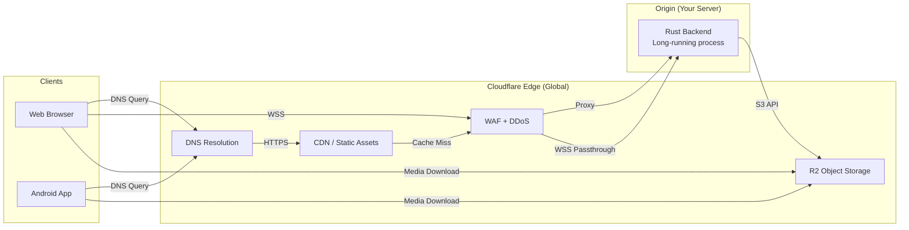

# Cloudflare Architecture — YBM Connect

| Field             | Value                                      |
|-------------------|--------------------------------------------|
| **Document ID**   | `DOC-CF-001`                               |
| **Version**       | `1.0.0`                                    |
| **Status**        | `APPROVED`                                 |
| **Owner**         | Engineering Lead                           |
| **Last Updated**  | 2026-10-02                                 |
| **Related Docs**  | DOC-ARCH-001, DOC-CF-002 through 010      |
| **Related ADRs**  | ADR-009, ADR-010                           |

---

## 1. What We Use Cloudflare For

| Service | How We Use It | Free Tier? |
|---------|--------------|------------|
| **DNS** | Domain resolution for api.ybmconnect.com, ybmconnect.com | ✅ Yes |
| **TLS** | Automatic HTTPS certificates, edge TLS termination | ✅ Yes |
| **CDN** | Cache static frontend assets (JS, CSS, images) | ✅ Yes |
| **DDoS Protection** | Layer 3/4/7 DDoS mitigation | ✅ Yes |
| **WAF** | Basic web application firewall rules | ⚠️ Limited on free tier |
| **R2** | Object storage for media (images, videos, documents, voice) | ✅ Yes (10GB free) |
| **Pages** | Static frontend deployment (optional) | ✅ Yes |

## 2. What We Do NOT Use Cloudflare For

| Service | Why Not |
|---------|---------|
| **Workers (for backend)** | Axum needs long-running WebSocket connections. Workers have a 30s CPU time limit (paid: 15 min wall clock). Not suitable for a persistent WebSocket server. |
| **Durable Objects** | Could be used for WebSocket coordination, but adds vendor lock-in and complexity. Redis provides the same coordination with a standard protocol. |
| **D1** | SQLite-based, single-region. PostgreSQL provides better relational capabilities, concurrent write handling, and scaling options. |
| **Queues** | Redis pub/sub and streams serve the same purpose without adding a Cloudflare-specific dependency. |

**Principle:** Use Cloudflare for edge infrastructure (DNS, TLS, CDN, storage). Keep the backend on traditional long-running compute (VPS, container, bare metal).

## 3. Architecture Diagram



## 4. DNS Configuration

```
Type    Name          Value                     Proxy    TTL
A       @             {origin_server_ip}        Proxied  Auto
A       api           {origin_server_ip}        Proxied  Auto
CNAME   www           ybmconnect.com            Proxied  Auto
```

- **Proxied mode:** Traffic goes through Cloudflare (CDN, WAF, DDoS protection). Origin IP is hidden.
- **SSL/TLS:** Full (Strict) mode — Cloudflare ↔ origin uses a valid TLS certificate (Let's Encrypt on origin or Cloudflare Origin Certificate).

## 5. R2 Object Storage

### Configuration

```
Bucket:    ybm-connect-media
Region:    Auto (Cloudflare selects nearest)
Public:    No (access via signed URLs only)
```

### Object Key Structure

```
{conversation_id}/{media_id}/original.{ext}
{conversation_id}/{media_id}/thumbnail.webp
```

### Signed URL Generation

The backend generates time-limited presigned URLs for media download:

```rust
// Generate presigned URL (1 hour expiry)
let presigned = s3_client
    .get_object()
    .bucket(&config.r2_bucket)
    .key(&media.r2_key)
    .presigned(PresigningConfig::expires_in(Duration::from_secs(3600))?)
    .await?;
```

Clients receive the signed URL and fetch media directly from R2. The backend never proxies media content.

### R2 Free Tier Limits

> ⚠️ **Verify against current Cloudflare documentation before deployment.**

| Resource | Free Tier Limit (as of writing) |
|----------|-------------------------------|
| Storage | 10 GB |
| Class A operations (write) | 1,000,000 / month |
| Class B operations (read) | 10,000,000 / month |
| Egress | Free (no egress fees — key advantage over S3) |

### Cost Estimates (Beyond Free Tier)

| Resource | Price (as of writing) |
|----------|----------------------|
| Storage | $0.015 / GB / month |
| Class A operations | $4.50 / million |
| Class B operations | $0.36 / million |
| Egress | Free |

**Cost projection for 1000 active users, 100 media/day:**
- Storage: ~10 GB/month → $0.15/month
- Writes: ~3,000/month → Free tier
- Reads: ~30,000/month → Free tier
- **Total: < $1/month** beyond free tier

## 6. WebSocket Through Cloudflare

Cloudflare supports WebSocket proxying on **all plans** (including free). Configuration:

1. The `api` DNS record must be **proxied** (orange cloud)
2. WebSocket connections upgrade through Cloudflare's edge
3. Cloudflare maintains the persistent connection to origin
4. Cloudflare timeout: **100 seconds** of inactivity (reset by any traffic, including pings)

**Heartbeat interval (30s)** is well within the 100s timeout. This ensures connections are not dropped by Cloudflare.

**Limitations:**
- Cloudflare may close connections after extended periods. Client reconnection logic handles this transparently.
- No sticky sessions at Cloudflare layer (handled by Redis-based routing in the backend).

## 7. Free Tier Strategy

For development and early portfolio deployment, we maximize free tier usage:

| Service | Free Tier Usage | When to Upgrade |
|---------|----------------|-----------------|
| DNS + CDN | Full project | Never (DNS is always free) |
| DDoS | Full project | If custom WAF rules needed |
| R2 | < 10 GB media | When storage exceeds 10 GB |
| Pages | Frontend hosting | When builds/bandwidth exceed limits |
| Workers | NOT used | If edge compute is needed in future |

**Total Cloudflare cost for portfolio project: $0/month** (within free tier limits).

---

*Next: [r2.md](r2.md) · [dns.md](dns.md) · [cost-model.md](cost-model.md)*
