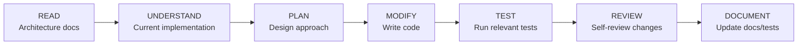

# Development Rules — YBM Connect

| Field             | Value                                      |
|-------------------|--------------------------------------------|
| **Document ID**   | `DOC-DEV-001`                              |
| **Version**       | `1.0.0`                                    |
| **Status**        | `APPROVED`                                 |
| **Owner**         | Engineering Lead                           |
| **Last Updated**  | 2026-10-02                                 |

---

## Engineering Rules

These 30 rules are non-negotiable. They exist to prevent common architectural mistakes and maintain development velocity.

### Architecture Rules

**RULE 1: Modular monolith before microservices.**
Start with a single deployable binary. Only extract a module into a separate service when it meets documented extraction criteria (ADR-011). Creating a separate service "because it has a different name" is not a valid reason.

**RULE 2: Every technology must have a documented reason.**
Before introducing any new dependency, database, runtime, or protocol, document: what problem it solves, what alternatives exist, why this option was chosen, and under what conditions the decision should be reconsidered.

**RULE 3: Every feature starts with a small technical design.**
Before writing code, write a 1-page design doc answering: What? Why? How? What could go wrong? What does the API look like? What database changes are needed? Even for "simple" features.

**RULE 4: Every API has a documented contract before implementation.**
Define request/response schemas, error codes, and authorization requirements in the API documentation before implementing the handler. This prevents API churn and ensures frontend and backend teams (or future contributors) share expectations.

**RULE 5: Every database migration must be reversible where practical.**
Write UP and DOWN migrations. Test both directions. If a migration cannot be reversed (e.g., dropping data), document this explicitly and ensure backups exist before applying.

**RULE 6: Never manually modify production database schema.**
All schema changes go through migration files. Even "quick fixes" in production must be applied via a migration that is committed to the repository.

### Code Quality Rules

**RULE 7: Every feature must have tests.**
No feature is complete without unit tests for business logic and integration tests for the API/WebSocket endpoint. The Definition of Done includes tests.

**RULE 8: Every bug fix should add a regression test.**
The test should reproduce the bug (fail) before the fix, and pass after the fix. This prevents the same bug from returning.

**RULE 9: Never duplicate business logic across frontend and backend unnecessarily.**
The backend is the source of truth. Validation exists on both sides, but the backend's validation is authoritative. Do not implement complex business rules only on the frontend.

**RULE 10: Keep domain logic independent from transport logic.**
The `MessagingService` should not know whether it was called from a REST handler or a WebSocket handler. Domain services accept typed parameters and return typed results.

**RULE 11: Do not put business logic inside WebSocket handlers.**
WebSocket handlers parse incoming messages, call service methods, and serialize responses. They do NOT contain business rules, database queries, or authorization checks.

**RULE 12: Do not access PostgreSQL directly from random modules.**
All database access goes through the Repository layer. Services call repository methods. This ensures query patterns are centralized, indexes are documented, and database changes don't ripple through the codebase.

**RULE 13: Use repository/service/domain boundaries.**
Handler → Service → Repository → Database. No shortcuts. No "just this once" direct database calls from handlers.

**RULE 14: Keep external providers behind interfaces/adapters.**
Email sending, push notifications, R2 storage, and Redis operations should be behind trait interfaces. This enables testing with mocks and swapping providers without touching business logic.

### Operational Rules

**RULE 15: Use feature flags for risky changes.**
Any change that could impact production stability should be gated behind a feature flag that can be toggled without redeployment.

**RULE 16: Use typed errors.**
Every module defines its own error enum. Errors propagate via `Result<T, ModuleError>`. Do not use `anyhow::Error` for domain errors (it erases type information). Use `thiserror` for defining domain error types.

**RULE 17: Use structured logging.**
All logs are JSON-formatted with consistent fields: `timestamp`, `level`, `service`, `request_id`. Use `tracing` crate with `tracing-subscriber`. Never use `println!` in production code.

**RULE 18: Every request receives a request ID.**
Generated as UUID v4 in middleware, propagated through all log entries and error responses. Enables end-to-end request tracing.

**RULE 19: Every important message receives a message ID.**
Client-generated `client_message_id` for idempotency. Server-generated `id` for authoritative reference.

**RULE 20: Use idempotency wherever retries can cause duplicates.**
Message sends, token refreshes, media uploads — anywhere a client might retry, the server must handle duplicates gracefully.

### Performance Rules

**RULE 21: Avoid premature optimization.**
Write correct, clear code first. Optimize only after measuring. "I think this will be slow" is not a measurement.

**RULE 22: Measure performance before optimizing.**
Use benchmarks, profiling, and production metrics to identify actual bottlenecks. Optimize the measured bottleneck, not the guessed one.

**RULE 23: Keep dependencies minimal.**
Every dependency is a maintenance burden and a security surface. Before adding a crate, check: Is this functionality already in std or in an existing dependency? Is the crate maintained? Is it well-tested?

**RULE 24: Do not create a microservice merely because a component has a separate name.**
"Notification Service" does not need to be a separate deployment. It's a module within the monolith until it has an independent scaling/deployment requirement.

### Concurrency Rules

**RULE 25: Use asynchronous processing for non-critical work.**
Sending push notifications, generating thumbnails, updating analytics — these don't block the request/response cycle. Send them to background workers via channels.

**RULE 26: Do not block Tokio async workers with blocking operations.**
Never call blocking I/O, CPU-heavy computation, or `std::thread::sleep` inside an `async fn`. Use `tokio::task::spawn_blocking` for blocking work or `tokio::time::sleep` for delays.

**RULE 27: Move CPU-heavy work to dedicated workers.**
Image thumbnail generation, video processing, and Argon2id hashing should run on dedicated Tokio blocking threads, not on the async executor's core threads.

**RULE 28: Use bounded queues to provide backpressure.**
All mpsc channels must have a bound. If a worker falls behind, the sender blocks (or drops with a warning), preventing unbounded memory growth.

**RULE 29: Never use infinite retry loops.**
Every retry must have a maximum attempt count, exponential backoff with jitter, and a circuit breaker. Infinite retries against a failing service will make the outage worse.

**RULE 30: Every external dependency must have timeout and failure handling.**
Database queries: 10s timeout. Redis operations: 5s timeout. HTTP calls: 30s timeout. All timeouts must be configurable.

---

## AI Development Rules

Because AI coding assistants are used during development, these rules prevent common AI-generated code problems.

### AI MUST:

1. **Read architecture documentation before modifying code.** Open the relevant `docs/` document for the module being changed.
2. **Search existing code before creating new code.** Use code search to find if a function, type, or pattern already exists.
3. **Reuse existing abstractions.** Do not create a new `send_email()` function if one already exists in the infrastructure layer.
4. **Never duplicate functionality.** If two modules need the same capability, extract it into a shared module.
5. **Never modify unrelated files.** A messaging feature should not touch auth module files.
6. **Explain architectural impact.** If a change affects the module boundary, data flow, or public API, explain the impact.
7. **Preserve API compatibility** unless explicitly instructed otherwise.
8. **Update documentation when architecture changes.** If you add a new endpoint, update the API docs. If you change a data flow, update the architecture doc.
9. **Update tests when behavior changes.** Changed behavior without updated tests is incomplete work.
10. **Add migration files for schema changes.** Never modify existing migration files; always create new ones.
11. **Never hardcode secrets.** Use environment variables or configuration files.
12. **Never invent environment variables.** Only use variables defined in `.env.example`.
13. **Never invent APIs.** Only implement endpoints documented in the API specification.
14. **Never assume external service behavior.** If you're unsure how FCM or R2 responds to a specific request, say so and check documentation.
15. **Verify dependency versions.** Use the version already in `Cargo.toml` or `package.json`.
16. **Explain why a dependency is required.** If adding a new crate, explain what problem it solves.
17. **Keep changes small.** One feature or one bug fix per change. Large changes are hard to review and risky.
18. **Prefer incremental implementation.** Build the simplest version first, test it, then enhance.
19. **Run relevant tests after changes.** Don't submit untested code.
20. **Report failed tests honestly.** Never claim tests pass if they don't.
21. **Never silently disable tests.** If a test needs to be skipped, annotate it with a reason.
22. **Never remove error handling to make code compile.** Fix the root cause instead.
23. **Never weaken authentication to solve development problems.** If auth is "in the way," fix the test setup, not the auth system.
24. **Never bypass authorization during debugging.** Use test fixtures with appropriate permissions.
25. **Never commit credentials.** Check staged files before committing.
26. **Never expose production secrets in logs.** Use the structured logging filter.
27. **Never make broad refactors unless requested.** Refactors need their own scope and review.
28. **Preserve backwards compatibility where required.** API versioning exists for a reason.
29. **Update diagrams when architecture changes.** Stale diagrams are misleading.
30. **Record major decisions as ADRs.** If the change involves choosing between approaches, write an ADR.

### AI Coding Workflow

For every change, the AI must follow this sequence. Skipping READ or UNDERSTAND leads to code that conflicts with the architecture. Skipping TEST leads to broken code. Skipping DOCUMENT leads to stale documentation.

---

*Next: [architecture-rules.md](architecture-rules.md) · [coding-standards.md](coding-standards.md)*
