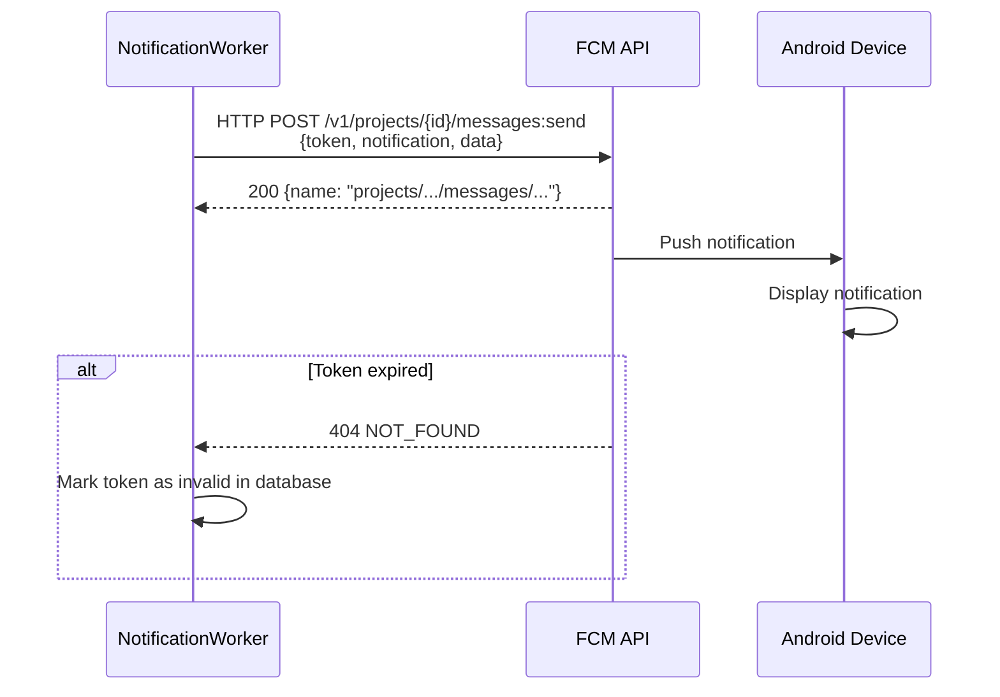
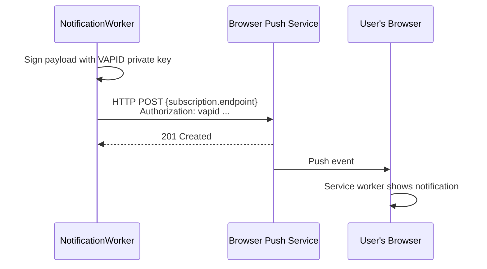

# Notifications Architecture — YBM Connect

| Field             | Value                                      |
|-------------------|--------------------------------------------|
| **Document ID**   | `DOC-NOTIF-001`                            |
| **Version**       | `1.0.0`                                    |
| **Status**        | `APPROVED`                                 |
| **Owner**         | Engineering Lead                           |
| **Last Updated**  | 2026-10-02                                 |
| **Related Docs**  | DOC-MSG-001, DOC-CALL-003, DOC-FE-002    |
| **Related Reqs**  | NOTIF-001, NOTIF-002                       |

---

## 1. When Notifications Are Sent

| Event | Send Push? | Condition |
|-------|-----------|-----------|
| New message in direct conversation | ✅ | Recipient has NO active WebSocket connection |
| New message in group | ✅ | For each member without active WebSocket, if not muted |
| Incoming call | ✅ | Always (even if connected — call notification has high priority) |
| Missed call | ✅ | Always |
| Added to group | ✅ | Always |
| Removed from group | ✅ | Always |
| Message reaction | ❌ | Too frequent, delivered via WebSocket only |
| Typing indicator | ❌ | Ephemeral, not notification-worthy |
| Presence change | ❌ | Not notification-worthy |

## 2. Push Notification Providers

### Android: Firebase Cloud Messaging (FCM)



### Web: W3C Web Push (VAPID)



## 3. Notification Payloads

### New Message

```json
{
  "notification": {
    "title": "Alice",
    "body": "Hey, are you available for a call?",
    "icon": "https://r2.../avatars/alice.webp",
    "tag": "conversation:abc123",
    "click_action": "/conversations/abc123"
  },
  "data": {
    "type": "NEW_MESSAGE",
    "conversation_id": "abc123",
    "message_id": "msg456",
    "sender_id": "user789",
    "sender_name": "Alice"
  }
}
```

### Group Message

```json
{
  "notification": {
    "title": "Project Team",
    "body": "Alice: Meeting at 3pm",
    "tag": "conversation:grp123"
  },
  "data": {
    "type": "NEW_MESSAGE",
    "conversation_id": "grp123",
    "message_id": "msg789",
    "group_name": "Project Team"
  }
}
```

### Incoming Call

```json
{
  "notification": {
    "title": "Incoming Audio Call",
    "body": "Alice is calling you",
    "priority": "high",
    "channel_id": "calls",
    "sound": "ringtone",
    "vibrate": [200, 100, 200, 100, 200]
  },
  "data": {
    "type": "INCOMING_CALL",
    "call_id": "call123",
    "caller_id": "user789",
    "caller_name": "Alice",
    "call_type": "audio"
  }
}
```

## 4. Notification Deduplication

To prevent notification spam:
1. Use `tag` field (FCM/Web Push) — notifications with the same tag replace each other
2. For group conversations, batch messages: "Alice: 3 new messages" instead of 3 separate notifications
3. Don't send notification if the user is actively viewing the conversation (WebSocket + conversation state)

## 5. Notification Worker

The NotificationWorker runs as a background Tokio task:
1. Receives notification events via mpsc channel
2. Looks up device push tokens from database
3. Sends to appropriate provider (FCM or Web Push)
4. Handles errors: invalid tokens → remove, temporary failures → retry

### Retry Strategy
- FCM temporary errors (429, 500, 503): Retry with exponential backoff (max 3 retries)
- FCM permanent errors (404 invalid token): Remove token from database
- Web Push 410 Gone: Remove subscription from database

## 6. Provider Abstraction

```rust
#[async_trait]
pub trait PushProvider: Send + Sync {
    async fn send(&self, token: &str, payload: &NotificationPayload) -> Result<(), PushError>;
}

pub struct ConsolePushProvider;  // Dev: log to console
pub struct FcmPushProvider;      // Production: Firebase Cloud Messaging
pub struct WebPushProvider;      // Production: W3C Web Push

// Selected by EMAIL_PROVIDER env var
```

---

*Next: [push-providers.md](push-providers.md) · [fcm.md](fcm.md)*
